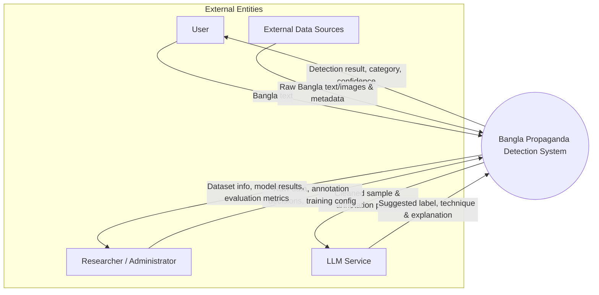
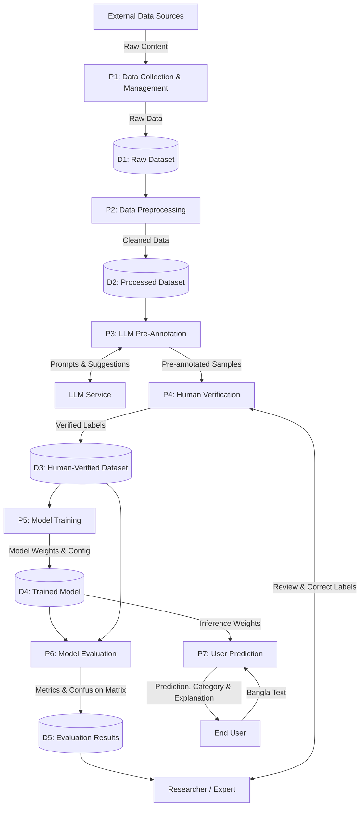
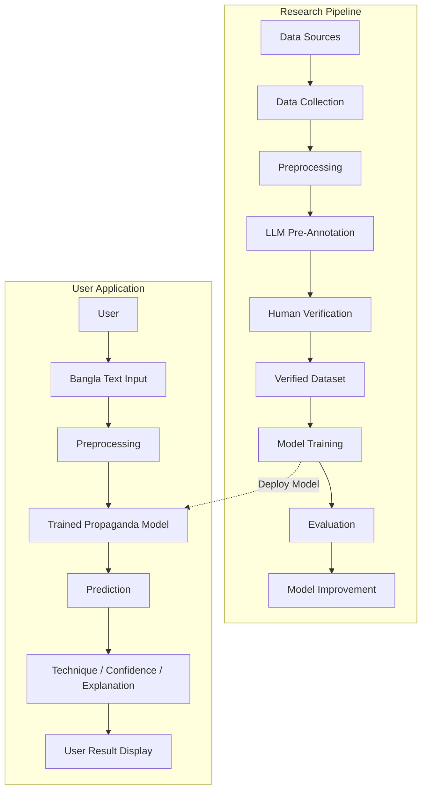

# A Multimodal AI Framework for Detecting Coordinated Propaganda in Bangla Online Media Content

**Degree:** Bachelor of Science in Computer Science and Engineering  
**Department:** Department of Computer Science and Engineering  
**Institution:** United International University, Dhaka, Bangladesh  
**Date:** September 2026  
**Group:** 262-037  
**Supervisor:** Dr. Jannatun Noor Mukta  

### Authors & Student IDs
- **Shekh Abdullah Al Mehedi** — ID: `112231075`
- **Mahjabin Khan** — ID: `112230177`
- **Omor Faruck Ullas** — ID: `112310384`
- **Md. Rayan Rahman** — ID: `112331071`

---

## Executive Summary & Abstract
Bangladesh's digital media ecosystem has experienced exponential expansion, currently hosting over 77.7 million internet users and 60.0 million social media user identities. While digital platforms democratize information exchange, they also serve as critical conduits for strategic, coordinated propaganda campaigns aimed at shaping public opinion and destabilizing civic discourse. Traditional automated propaganda detection architectures predominantly focus on high-resource languages (e.g., English) and evaluate isolated, text-only posts. In contrast, under-resourced languages like Bangla lack comprehensive multimodal annotated corpora, fine-grained persuasive technique taxonomies, and coordinated campaign detection systems.

This report presents the design and architectural methodology of a **Multimodal AI Framework for Detecting Coordinated Propaganda in Bangla Online Media Content**. The proposed framework unites:
1. A hybrid human-in-the-loop annotation pipeline utilizing Large Language Models (LLMs) for pre-annotation and domain experts for ground-truth verification.
2. An extensible multimodal classification pipeline comparing classical machine learning baselines with specialized transformer architectures (BanglaBERT and XLM-RoBERTa).
3. Coordinated campaign detection modules integrating semantic representations, temporal posting patterns, and network-level interaction graphs.

---

## Table of Contents
- [1. Introduction](#1-introduction)
  - [1.1 Project Overview](#11-project-overview)
  - [Problem Statement](#problem-statement)
  - [1.2 Motivation](#12-motivation)
  - [1.3 Objectives](#13-objectives)
  - [1.4 Methodology](#14-methodology)
  - [1.5 Project Outcome](#15-project-outcome)
  - [1.6 Organization of the Report](#16-organization-of-the-report)
- [2. Background](#2-background)
  - [2.1 Preliminaries](#21-preliminaries)
    - [2.1.1 Propaganda](#211-propaganda)
    - [2.1.2 Misinformation and Harmful Content](#212-misinformation-and-harmful-content)
    - [2.1.3 Machine Learning for Content Detection](#213-machine-learning-for-content-detection)
    - [2.1.4 Deep Learning and Transformer Models](#214-deep-learning-and-transformer-models)
    - [2.1.5 Graph-Based Detection](#215-graph-based-detection)
    - [2.1.6 Multimodal Detection](#216-multimodal-detection)
    - [2.1.7 Behavioral and Network Signals](#217-behavioral-and-network-signals)
    - [2.1.8 Low-Resource Languages](#218-low-resource-languages)
  - [2.2 Literature Review](#22-literature-review)
    - [2.2.1 Similar Applications](#221-similar-applications)
    - [2.2.2 Related Research](#222-related-research)
  - [2.3 Gap Analysis](#23-gap-analysis)
    - [2.3.1 Gap 1: Limited Support for Low-Resource Languages](#231-gap-1-limited-support-for-low-resource-languages)
    - [2.3.2 Gap 2: Heavy Dependence on Text](#232-gap-2-heavy-dependence-on-text)
    - [2.3.3 Gap 3: Limited Use of Behavioral Information](#233-gap-3-limited-use-of-behavioral-information)
    - [2.3.4 Gap 4: Data Quality and Annotation Problems](#234-gap-4-data-quality-and-annotation-problems)
    - [2.3.5 Gap 5: Generalization Across Datasets and Domains](#235-gap-5-generalization-across-datasets-and-domains)
    - [2.3.6 Gap 6: Explainability](#236-gap-6-explainability)
    - [2.3.7 Proposed Research Opportunity](#237-proposed-research-opportunity)
  - [2.4 Summary](#24-summary)
- [3. Project Design](#3-project-design)
  - [3.1 Project Design Overview](#31-project-design-overview)
  - [3.2 Requirement Analysis](#32-requirement-analysis)
    - [3.2.1 Functional and Nonfunctional Requirements](#321-functional-and-nonfunctional-requirements)
    - [3.2.2 Context Diagram](#322-context-diagram)
    - [3.2.3 Data Flow Diagram Level 1](#323-data-flow-diagram-level-1)
    - [3.2.4 UI Design](#324-ui-design)
  - [3.3 Detailed Methodology and Design](#33-detailed-methodology-and-design)
    - [3.3.1 Overall Design Approach](#331-overall-design-approach)
    - [3.3.2 Alternative Solution 1: Building a Large Dataset Completely From Scratch](#332-alternative-solution-1-building-a-large-dataset-completely-from-scratch)
    - [3.3.3 Alternative Solution 2: Fully Automatic LLM Annotation](#333-alternative-solution-2-fully-automatic-llm-annotation)
    - [3.3.4 Alternative Solution 3: Complete Manual Annotation](#334-alternative-solution-3-complete-manual-annotation)
    - [3.3.5 Alternative Solution 4: Traditional Machine Learning](#335-alternative-solution-4-traditional-machine-learning)
    - [3.3.6 Alternative Solution 5: BanglaBERT vs. XLM-R](#336-alternative-solution-5-banglabert-vs-xlm-r)
    - [3.3.7 Alternative Solution 6: Text-Only vs. Multimodal Detection](#337-alternative-solution-6-text-only-vs-multimodal-detection)
    - [3.3.8 Dataset Design](#338-dataset-design)
    - [3.3.9 Annotation Design](#339-annotation-design)
    - [3.3.10 Class Imbalance Design](#3310-class-imbalance-design)
    - [3.3.11 Training and Testing Design](#3311-training-and-testing-design)
    - [3.3.12 Experimental Design](#3312-experimental-design)
    - [3.3.13 Evaluation Design](#3313-evaluation-design)
    - [3.3.14 Error Analysis](#3314-error-analysis)
    - [3.3.15 Final System Architecture](#3315-final-system-architecture)
    - [3.3.16 Why the Proposed Design Was Selected](#3316-why-the-proposed-design-was-selected)
- [Bibliography](#bibliography)

---

# 1. Introduction

This chapter presents an overview of the proposed research on coordinated propaganda detection in Bangla digital media. It outlines the project background, problem statement, core motivation, research objectives, methodology, expected outcomes, and the structural organization of the report.

## 1.1 Project Overview
Bangladesh's digital media ecosystem has become a major source of information for millions of people, alongside continued growth in internet access and social media use. According to DataReportal's *Digital 2025: Bangladesh*, the country had **77.7 million internet users** and **60.0 million social media user identities** in early 2025, demonstrating how strongly online platforms now shape news circulation and public opinion.

Within this environment, **propaganda** refers to strategically crafted information designed to influence public attitudes, beliefs, or actions. In the digital age, such content is often spread through coordinated campaigns, repeated messaging, and networked amplification, making it more scalable and harder to detect than isolated misinformation. This issue is especially important in Bangladesh, where online platforms are deeply embedded in political communication, election-related discourse, and reactions to controversial events, all of which increase the potential impact of coordinated influence operations [1].

### Problem Statement
Most automated propaganda detection systems to date have been developed for English and other languages with abundant digital resources. Bangla, by contrast, still lacks large annotated datasets and detection frameworks capable of identifying coordinated propaganda across text, images, and cross-platform activity, which leaves a substantial research and practical gap [2]. This project responds to that gap by proposing a Bangla propaganda dataset and an AI-based detection framework tailored to Bangladesh's online media environment. The goal is to support more accurate, scalable, and context-sensitive detection of coordinated propaganda campaigns in Bangla-language digital spaces [2, 3].

## 1.2 Motivation
The motivation for this project extends beyond building a detection system. In an increasingly digital society, people rely on online information to understand current events, form opinions, and make decisions that affect their communities and democratic processes. When coordinated propaganda manipulates information at scale, it can undermine public trust, distort discourse, and reduce people's ability to make informed judgments [1].

This project is grounded in the belief that individuals should be able to think independently rather than have their perceptions shaped by coordinated manipulation. Supporting that independence requires a digital environment in which misleading influence campaigns can be identified and examined more effectively. Technology alone cannot eliminate propaganda, but it can provide tools that improve transparency and help users evaluate online content more critically [4].

From a research standpoint, the scarcity of Bangla-language resources for this task presents an opportunity. Existing Bangla work has already shown the value of annotated datasets and benchmark systems for low-resource language processing, and the same need extends to multimodal and propaganda-oriented settings. In this way, the project aims to contribute both to advances in AI research and to a more trustworthy online information ecosystem in Bangladesh [2].

## 1.3 Objectives
The primary purpose of this research is to build a foundational AI framework and dataset for the Bangla digital media environment that can effectively detect and analyze coordinated propaganda campaigns [4].

As this research is currently in its initial phase, the specific objectives are enumerated below:
1. **Create a large-scale, multimodal Bangla dataset:** Compile and annotate a comprehensive dataset spanning diverse domains, such as politics and news, including both textual and visual elements, using hybrid annotation pipelines that combine human expertise with LLM assistance to scale the process efficiently [2].
2. **Develop an AI model for propaganda detection:** Architect and train a multimodal machine learning framework optimized for the linguistic nuances of Bangla to classify manipulative and propagandistic content [2].
3. **Analyze coordinated campaigns:** Combine semantic, temporal, and network-level signals to detect organized, scalable influence operations rather than isolated pieces of misinformation [4].
4. **Evaluate model performance:** Conduct baseline evaluations against current state-of-the-art models, such as fine-tuned transformers and cross-lingual models, to assess accuracy, scalability, and context-sensitivity in the Bangladeshi digital landscape [2].
5. **Establish open resources for future research:** Make the annotated dataset and architectural findings accessible to the academic community to support further advances in NLP, multimodal machine learning, and digital media analysis for low-resource languages [2].

## 1.4 Methodology
To achieve these objectives, the research follows a structured, multi-phase methodology. The workflow is designed to establish the data pipeline and baseline models needed for this context and proceeds through five core phases [4]:
- **Data Collection and Integration:** Raw data containing text and visual elements across politics, sports, and entertainment is systematically gathered using automated web scrapers and validated manually.
- **Data Cleaning and Preprocessing:** Unstructured text is cleaned, standardized, tokenized, and normalized into machine-readable formats tailored for Bangla NLP tasks.
- **Dataset Annotation and Construction:** A hybrid pipeline uses LLMs for initial pre-annotation and span extraction, followed by human expert verification to ensure label quality and reduce bias [2].
- **Multimodal Model Development:** Semantic features, temporal metrics, and social network structure are fused to pinpoint coordinated campaigns rather than standalone posts [4].
- **Evaluation and Comparative Analysis:** Benchmarks are run against transformer architectures and cross-lingual models to measure real-world performance on Bangladeshi digital media contexts [2].

## 1.5 Project Outcome
By the end of this phase of the research, the project is expected to deliver the following major concrete outputs [2]:
- An annotated multimodal Bangla propaganda dataset covering multiple public domains.
- A trained AI framework designed for detecting coordinated digital propaganda.
- A comprehensive baseline evaluation comparing the proposed architecture against state-of-the-art models.
- Openly available dataset resources and benchmarks to foster future NLP and multimodal research for under-resourced languages [1].

## 1.6 Organization of the Report
The remainder of this report is organized as follows:
- **Chapter 2 (Background):** Presents the necessary preliminaries, reviews similar applications and related research, and identifies the research gaps relevant to coordinated propaganda detection in Bangla online media.
- **Chapter 3 (Project Design):** Describes the project requirements, context diagram, data flow diagram, user interface design, and the detailed methodology and design of the proposed framework.
- **Chapter 4 (Implementation and Results):** Presents the implementation of the proposed system along with the experimental setup, evaluation results, and analysis of the obtained findings.
- **Chapter 5 (Standards and Design Constraints):** Discusses the standards followed during the development of the project and the technical, design, and implementation constraints considered in the proposed framework.
- **Chapter 6 (Conclusion):** Summarizes the major findings and contributions of the project, discusses the limitations of the proposed framework, and presents possible directions for future work.

---

# 2. Background

This chapter provides the background knowledge needed to understand the proposed work and discusses existing applications and research related to propaganda, misinformation, and harmful-content detection. It also identifies the main research gaps that motivate the proposed system.

## 2.1 Preliminaries
Social media has become an important platform for sharing news, opinions, images, and other information. At the same time, it can also be used to spread propaganda, misinformation, hate speech, manipulation, and other harmful content. Because harmful information can spread very quickly, automatic detection systems are becoming increasingly important.

### 2.1.1 Propaganda
Propaganda is information designed to influence people's opinions or behavior, often by using selective information, emotional language, misleading presentation, or other persuasive techniques. In social media, propaganda can appear as text, images, videos, hashtags, or coordinated posts.

### 2.1.2 Misinformation and Harmful Content
Misinformation refers to incorrect or misleading information. Harmful online content is a broader term that can include hate speech, offensive language, harassment, manipulated information, and other content that may cause social harm. These types of content can be difficult to detect automatically because their meaning often depends on context.

### 2.1.3 Machine Learning for Content Detection
Machine learning (ML) allows a computer system to learn patterns from previously labeled examples. Traditional ML methods such as Support Vector Machines (SVM) have been widely used for text classification. More recent systems use deep learning and transformer-based language models to understand more complex language patterns [5, 6].

### 2.1.4 Deep Learning and Transformer Models
Deep learning (DL) models can automatically learn useful features from data. Transformer-based models are particularly useful for language tasks because they can capture relationships between words over a long text. Models such as BERT and language models adapted to specific languages have therefore become common in harmful-content detection [5, 7, 8].

### 2.1.5 Graph-Based Detection
Graph-based approaches represent information as connected nodes and relationships. They are useful when the relationship between words, users, posts, or accounts is important. For example, propaganda can depend on relationships between different parts of a text rather than on individual words alone. Ahmad et al. used a hierarchical graph-based model to capture such relationships in propaganda detection [9].

### 2.1.6 Multimodal Detection
Social media posts often contain more than one type of information. A post may contain text and an image together. Multimodal detection combines these different sources of information to make a prediction. Research has shown that image information can provide important clues for fake-news and hateful-meme detection [10, 11].

### 2.1.7 Behavioral and Network Signals
The behavior of a social-media account can also provide useful information. Examples include how often an account posts, how it interacts with other users, and whether it participates in coordinated activity. These signals can be useful when the actual content is difficult to trust or is deliberately changed to avoid detection [12–14].

### 2.1.8 Low-Resource Languages
A low-resource language is a language for which relatively few labeled datasets, language models, or other computational resources are available. Bengali is an example where researchers have identified limitations in annotated datasets and language resources [7, 8, 15]. This makes harmful-content detection more challenging than in high-resource languages such as English.

---

## 2.2 Literature Review
The reviewed literature focuses on computational methods for detecting propaganda, misinformation, manipulation, hate speech, sarcasm, and related harmful content. The studies cover traditional machine learning, deep learning, graph models, transfer learning, multimodal methods, behavioral analysis, and large language models (LLMs) [5, 6, 9, 14].

The literature can be divided into two areas: **similar applications** and **related academic research**.

### 2.2.1 Similar Applications
Several existing tools and systems address parts of the problem of detecting misinformation, manipulated information, or suspicious online activity. These systems show that automated analysis can be provided through web-based interfaces and APIs, although they do not necessarily perform exactly the same task as the proposed system.

- **Bot-detection and Coordination Analysis Systems:** Some systems focus on identifying automated or coordinated social-media accounts. Research-based systems such as those discussed by De Clerck et al. analyze account behavior and coordination patterns to identify bot-like activity [12]. These systems are related to the proposed work because they show how user behavior can be used in addition to the content of a post.
- **Fact-checking Systems:** Fact-checking platforms and services allow users or applications to check whether claims have already been reviewed. Google provides Fact Check Tools that support searching and working with fact-check information through an API [16]. Google also supports the `ClaimReview` format for representing fact-check results in a structured way [17]. Such systems are related because they support verification of questionable information, although fact-checking is different from automatically detecting propaganda techniques.
- **Social-media Misinformation Analysis:** Other applications and research systems analyze how information spreads through social networks. The work of Sela et al. shows that repetition patterns and network structures can provide signals for identifying political influence in information spread [13]. These systems are relevant because they demonstrate that harmful information can be analyzed at both the content level and the network level.
- **Limitations of Existing Applications:** A common limitation of existing applications is that they often focus on one specific problem, such as fact checking, bot detection, or misinformation analysis. A system that combines these ideas with low-resource language and multimodal analysis can address a broader set of challenges.

### 2.2.2 Related Research

#### Propaganda Detection Using Machine Learning and Deep Learning
Traditional machine learning remains useful for some propaganda detection tasks. Duridi et al. found that SVM performed better than AraBERT for propaganda detection in their Arabic social-media dataset, while AraBERT performed better for bias detection [5]. This result shows that the most advanced model is not always the best model for every task.

Ahmad et al. proposed a Hierarchical Graph-based Integration Network (H-GIN) for propaganda detection. The model uses graph-based information to capture long-range and non-adjacent relationships that can be missed by standard sequence models. The study reported an accuracy of 82% for its evaluated task [9].

These studies show that both traditional and advanced models can be useful. The choice of model depends on the task, the dataset, and the type of information that needs to be captured.

#### Behavioral and Network-Based Detection
Recent research has moved beyond text-only detection. De Clerck et al. studied coordinated and bot-like behavior on Twitter and showed that patterns of account activity can help identify suspicious behavior [12].

Sela et al. also found that repetition patterns and network structure can provide useful signals for identifying political influence in information spread [13].

Schneider et al. further developed this idea by focusing on user behavior rather than only the content of posts. In their Reddit study, behavioral-policy representations achieved a macro-F1 of 94.9%, compared with 91.2% for text embeddings in the evaluated actor-detection task [14].

These studies suggest that user behavior and network structure can provide information that cannot be obtained from text alone.

#### Low-Resource Language Detection
Low-resource languages face important challenges because of limited data and language resources. Haider et al. studied manipulation detection in low-resource languages and showed that transfer learning can help when only a small amount of training data is available in the target language [18].

For Bengali, Lora et al. developed a transformer-based model for sarcasm detection. Their results differed across datasets, showing that model performance can depend strongly on the characteristics of the available corpus [7].

Romim et al. introduced the BD-SHS benchmark dataset for Bangla hate-speech detection. The dataset contains manually annotated comments from different social contexts, and the study reported a best F1-score of 91.0% for its evaluated system [15].

More recent work by Hasan et al. introduced BanglaMultiHate, which considers several aspects of hate speech, including type, severity, and target. The study evaluated classical machine learning, BanglaBERT, and LLM-based approaches [8].

Together, these studies show that successful moderation in Bangla requires larger datasets, better annotation, and models that understand local language and social context.

#### Multimodal Detection
Lin et al. proposed a text-image fusion model for fake-news detection. Their results demonstrate that combining text and image information can improve detection compared with using only one modality [10].

Hee et al. studied multimodal hateful memes and found that images can provide important information for classification. However, they also observed that multimodal systems may learn unwanted biases and produce false positives [11].

Wang et al. investigated image-based political propaganda and showed that visual elements such as colors can be used in different ways by political groups [19].

These findings suggest that text-only systems may miss important visual information. Therefore, multimodal analysis is an important direction for future harmful-content detection.

#### Large Language Models
Large language models are a newer research direction in propaganda detection. Piña-García used few-shot LLaMA 3.2 to classify propagandistic tweets and examine linguistic and coordination patterns in Mexican election-related data [20].

Gaeta et al. proposed an LLM-based system that detects propaganda and identifies the specific parts of a text that contain propagandistic content [21].

However, LLM performance depends strongly on data quality. Maarouf et al. showed that models trained with weak labels achieved an AUC of 64.03, whereas models trained with high-quality human annotations achieved an AUC of 92.25. Prompt-based learning with a smaller set of high-quality samples achieved an AUC of 80.27 [22].

This indicates that better models alone are not enough. High-quality training and evaluation data are also essential.

---

## 2.3 Gap Analysis
The reviewed literature shows several important gaps that can be addressed by the proposed work:

### 2.3.1 Gap 1: Limited Support for Low-Resource Languages
Many existing systems are developed and tested mainly on high-resource languages. Research on Bengali and Bangla shows that limited annotated datasets and language resources remain major problems [7, 8, 15]. More work is needed on systems that can effectively handle low-resource languages.

### 2.3.2 Gap 2: Heavy Dependence on Text
Many detection systems focus mainly on textual information. However, social-media content often includes images, and important information may appear in the relationship between text and images [10, 11]. This creates a need for systems that can analyze multiple modalities together.

### 2.3.3 Gap 3: Limited Use of Behavioral Information
Traditional content-based systems may fail when users intentionally change or disguise their language. Behavioral and network-based research shows that user activity and coordination can provide additional evidence [12–14]. However, these signals are not always integrated with text and multimodal models.

### 2.3.4 Gap 4: Data Quality and Annotation Problems
The quality of the training data has a strong effect on model performance. HQP demonstrates that high-quality human annotation can produce much better results than weak labeling [22]. Bangla research also emphasizes the importance of culturally grounded and socially diverse datasets [8, 15].

### 2.3.5 Gap 5: Generalization Across Datasets and Domains
A model can perform well on one dataset but perform differently on another dataset. The reviewed literature therefore indicates the need for evaluation across multiple datasets, domains, and languages rather than relying on a single benchmark [9].

### 2.3.6 Gap 6: Explainability
Many machine-learning and deep-learning systems provide a final classification without clearly explaining why a particular post was detected as harmful. This can be especially problematic for propaganda, sarcasm, memes, and culturally sensitive content. More interpretable systems are therefore needed [9, 11, 22].

### 2.3.7 Proposed Research Opportunity
Based on these gaps, there is an opportunity to develop a system that combines multiple types of evidence. Such a system could use text analysis together with image information and, where available, behavioral or network signals. For a low-resource language such as Bangla, the system could also use language-specific pretrained models and carefully annotated local datasets.

The main focus should therefore be on building a detection approach that is not dependent on a single signal or a single dataset. It should be evaluated for accuracy, robustness, and generalization across different types of online content.

## 2.4 Summary
This chapter presented the background concepts needed to understand propaganda and harmful-content detection. It discussed machine learning, deep learning, graph-based approaches, multimodal analysis, behavioral signals, and the challenges of low-resource languages.

The literature review showed that researchers are moving from text-only systems toward approaches that combine content, user behavior, network structure, images, and large language models [5–15, 18–22]. The studies also show that no single method works equally well for every task. Model performance depends on the problem, the dataset, the available language resources, and the quality of annotation.

The gap analysis identified several areas that still need improvement, especially low-resource language support, multimodal analysis, behavioral information, data quality, cross-dataset evaluation, and explainability. These gaps provide the motivation for developing a more integrated detection system that can work with low-resource and multimodal social-media content.

---

# 3. Project Design

## 3.1 Project Design Overview
This chapter presents the design of the proposed Bangla propaganda detection system. It describes the system requirements, overall interaction and data flow, user-interface design, and the detailed methodology, including alternative solutions considered and the reasons for selecting the proposed approach.

## 3.2 Requirement Analysis
Requirement analysis identifies what the proposed system should do and what constraints it should satisfy. The requirements are divided into functional and nonfunctional requirements, followed by diagrams showing how users, data, and system components interact.

### 3.2.1 Functional and Nonfunctional Requirements

#### Functional Requirements
- **FR1: User Input:** The system shall allow a user to enter or submit Bangla text for analysis.
- **FR2: Text Preprocessing:** The system shall clean and prepare the submitted Bangla text before sending it to the detection model.
- **FR3: Propaganda Detection:** The system shall analyze the input text and determine whether propaganda is present.
- **FR4: Propaganda Technique Identification:** When propaganda is detected, the system should identify the possible propaganda technique, such as loaded language, fear appeal, or bandwagon, based on the final label set used in the dataset.
- **FR5: Result Display:** The system shall display the prediction clearly to the user:
  - *Input:* Bangla social-media text
  - *Prediction:* Propaganda Detected
  - *Technique:* Loaded Language
- **FR6: Confidence Information:** The system may display a confidence score or confidence level associated with the prediction.
- **FR7: Dataset Management:** The research component of the system shall support the collection, cleaning, annotation, verification, and storage of Bangla propaganda examples.
- **FR8: LLM-Assisted Pre-Annotation:** The dataset-development pipeline shall allow an LLM to generate an initial label suggestion for collected Bangla content.
- **FR9: Human Verification:** The system or research workflow shall allow a human annotator to review and correct the LLM's suggested label.
- **FR10: Model Training:** The research pipeline shall support training and fine-tuning of the selected propaganda detection model using the human-verified dataset.
- **FR11: Model Evaluation:** The system shall calculate evaluation measures including accuracy, precision, recall, and F1-score.
- **FR12: Iterative Dataset Improvement:** The research workflow shall identify poorly performing classes and allow additional data to be collected or generated and verified.

#### Nonfunctional Requirements
- **NFR1: Usability:** The user interface should be simple enough that a user can submit Bangla text and understand the prediction without technical knowledge.
- **NFR2: Performance:** The system should provide predictions within a reasonable response time for normal user requests.
- **NFR3: Reliability:** The system should provide consistent results when the same input is analyzed under the same model configuration.
- **NFR4: Accuracy:** The model should achieve acceptable performance according to the selected evaluation metrics.
- **NFR5: Maintainability:** The system should be designed so that the detection model and dataset can be updated without rebuilding the complete application.
- **NFR6: Scalability:** The architecture should allow the dataset and model to grow beyond the initial 500–1,000 custom samples.
- **NFR7: Security:** User-submitted data and research data should be handled securely and unnecessary personal information should not be stored.
- **NFR8: Explainability:** Where feasible, the system should provide useful information about why a text was classified as potentially propagandistic rather than displaying only a class label.
- **NFR9: Language Support:** The main detection workflow shall support Bangla text.

---

### 3.2.2 Context Diagram
The context diagram represents the proposed system as a single high-level process and shows its relationship with external entities.

The main external entities are:
1. **User:**
   - *User → System:* Bangla text
   - *System → User:* Detection result, propaganda category, and optional confidence information
2. **Researcher / Administrator:**
   - The researcher manages the research dataset and model-development process.
   - *Researcher → System:* Raw data, annotation decisions, training configuration
   - *System → Researcher:* Dataset information, model results, evaluation metrics
3. **LLM Service:**
   - The LLM is used during the dataset-development stage as a pre-annotation assistant.
   - *System → LLM:* Bangla sample and annotation prompt
   - *LLM → System:* Suggested label, possible technique, and explanation
   - *(Note: The LLM output is not considered the final ground truth; human verification is strictly required).*
4. **External Data Sources:**
   - Publicly available datasets and other permitted sources provide the initial and additional Bangla data used during system development.
   - *External Data Sources → System:* Bangla text/images and associated metadata where available.



*Figure 3.1: Context Diagram — The proposed system acts as the central component connecting the user, research workflow, external datasets, and the LLM-based annotation assistant.*

---

### 3.2.3 Data Flow Diagram Level 1
The Level 1 Data Flow Diagram (DFD) expands the main system into its major internal processes and data stores:

#### Processes
- **P1: Data Collection and Management:** Collects Bangla data from existing datasets and permitted online sources.
- **P2: Data Preprocessing:** Cleans, normalizes, and prepares the collected data.
- **P3: LLM Pre-Annotation:** Sends the cleaned samples to the LLM and receives possible propaganda labels and explanations.
- **P4: Human Verification:** Allows the researcher or annotator to review the LLM output and produce the final verified label.
- **P5: Model Training:** Uses the verified dataset to fine-tune the selected machine-learning model.
- **P6: Model Evaluation:** Evaluates the trained model using accuracy, precision, recall, F1-score, and class-wise performance.
- **P7: User Prediction:** Receives new Bangla text from the user, preprocesses it, sends it to the trained model, and returns the prediction.

#### Main Data Stores
- **D1: Raw Dataset:** Stores collected Bangla data before processing.
- **D2: Processed Dataset:** Stores cleaned and prepared data.
- **D3: Human-Verified Dataset:** Stores the final dataset with human-confirmed labels.
- **D4: Trained Model:** Stores the trained propaganda detection model.
- **D5: Evaluation Results:** Stores performance measures and experimental results.



*Figure 3.2: Level 1 Data Flow Diagram (DFD) — Illustrates the dual-workflow architecture: the research & model-development pipeline and the end-user prediction workflow.*

---

### 3.2.4 UI Design
The proposed application uses a simple, intuitive interface so that users can easily submit Bangla content and understand the result.

#### Main Screen
The main screen contains:
- Application Title: **Bangla Propaganda Detection System**
- Short explanation of the system purpose
- Bangla text input area
- "Analyze" button
- Result section

```
+------------------------------------------------------------------+
|               Bangla Propaganda Detection System                 |
|   Analyze Bangla digital content for persuasive & propaganda cues |
+------------------------------------------------------------------+
| Enter Bangla Text:                                               |
| +--------------------------------------------------------------+ |
| | [Textarea: এখানে বাংলা সোশ্যাল মিডিয়া পোস্ট বা খবর লিখুন...]     | |
| +--------------------------------------------------------------+ |
|                                                                  |
|                          [ Analyze ]                             |
+------------------------------------------------------------------+
| Result:                                                          |
|  - Prediction: Propaganda Detected                               |
|  - Technique:  Loaded Language                                   |
|  - Confidence: Medium                                            |
|  - Explanation: The text contains emotionally strong wording     |
|                 that may influence the reader.                   |
+------------------------------------------------------------------+
```

*Figure 3.3: Main Screen Result Interface*

#### Result Interface
The result page clearly separates the input, prediction, and explanation:
- **Prediction:** Propaganda Detected
- **Possible Technique:** Loaded Language
- **Confidence:** Medium
- **Explanation:** The text contains emotionally strong wording that may influence the reader.

*(The explanation should be treated as supporting information rather than as a replacement for the classification result).*

#### Annotation Interface
A separate interface is used by the researcher or annotator to support the LLM pre-annotation $
ightarrow$ human verification workflow:

```
+------------------------------------------------------------------+
|               Researcher / Annotator Interface                   |
+------------------------------------------------------------------+
| Sample ID: #1042                                                 |
| Text: "..." (Bangla Sample Text)                                 |
|                                                                  |
| LLM Suggested Label:   [ Propaganda Detected ]                   |
| Suggested Technique:   [ Fear Appeal ]                           |
| LLM Rationale:         Mentions severe imminent societal threat  |
|                                                                  |
| Human Decision:                                                  |
| ( ) Accept LLM Suggestion                                        |
| ( ) Modify Label: [ Select Technique Dropdown v ]               |
| ( ) Mark Ambiguous / Sarcastic                                   |
|                                                                  |
| Annotator Notes: [                                             ] |
|                                                                  |
|                    [ Confirm Ground Truth ]                      |
+------------------------------------------------------------------+
```

*Figure 3.4: Annotation Interface*

---

## 3.3 Detailed Methodology and Design
This section explains how the proposed system will be developed and why the selected solutions are appropriate. Several alternative approaches were considered before selecting the proposed combination of existing datasets, human-verified custom data, transformer-based models, and LLM-assisted annotation.

### 3.3.1 Overall Design Approach
The project follows an iterative design rather than attempting to build the complete system in a single step:

$$	ext{Existing Dataset} \longrightarrow 	ext{Baseline Pipeline} \longrightarrow 	ext{Custom Dataset} \longrightarrow 	ext{Annotation} \longrightarrow 	ext{Model Training} \longrightarrow 	ext{Evaluation} \longrightarrow 	ext{Improvement}$$

This approach reduces development risk because the model-development pipeline can be tested before the custom dataset is complete.

---

### Alternative Solutions Considered

#### 3.3.2 Alternative Solution 1: Building a Large Dataset Completely From Scratch
One possible approach was to immediately collect and manually annotate a very large Bangla dataset (e.g., attempting to manually label 10,000–50,000 samples before beginning model development).
- **Advantages:**
  - Labels would be created specifically for the research task.
  - The dataset could be designed around the exact propaganda categories required.
- **Disadvantages:**
  - Manual annotation would require a large amount of time.
  - The cost of annotation would increase significantly.
  - Difficult and ambiguous examples would require additional review.
  - Model development would need to wait until a large dataset was completed.
- **Selected Approach:** The proposed research instead begins with existing datasets and gradually creates a smaller custom dataset. This allows the technical pipeline to be developed immediately and reduces the initial annotation burden.

#### 3.3.3 Alternative Solution 2: Fully Automatic LLM Annotation
Another possible solution was to ask an LLM to label all collected samples and directly use those labels as the dataset ground truth.
- **Advantages:**
  - Very fast compared with manual annotation.
  - Large quantities of data can be labeled automatically.
  - Reduces human workload.
- **Disadvantages:**
  - LLM predictions can be incorrect.
  - Ambiguous Bangla language may be interpreted incorrectly.
  - The LLM may introduce systematic labeling bias.
  - Using LLM labels as ground truth may reduce the reliability of the dataset.
- **Selected Approach:** The proposed system uses the LLM only for pre-annotation. Every final label must be checked by a human annotator. Therefore:
  $$	ext{LLM Suggestion} 
eq 	ext{Ground Truth}$$
  The ground truth is the final human-verified label.

#### 3.3.4 Alternative Solution 3: Complete Manual Annotation
A third approach is to manually annotate every collected sample without using an LLM.
- **Advantages:**
  - Direct human judgment.
  - Better control over the annotation process.
  - No dependence on LLM-generated suggestions.
- **Disadvantages:**
  - Very time-consuming.
  - More expensive in terms of researcher effort.
  - Difficult to scale if the dataset becomes larger.
  - Annotators may become tired, which can reduce consistency.
- **Selected Approach:** The proposed LLM-assisted approach provides a compromise. The LLM performs an initial classification, while humans make the final decision. This reduces repetitive work without removing human control.

#### 3.3.5 Alternative Solution 4: Traditional Machine Learning
Traditional models such as SVM, Logistic Regression, or Naive Bayes could be used as the main final classifier.
- **Advantages:**
  - Simple to implement.
  - Fast to train.
  - Computationally inexpensive.
  - Useful as baseline models.
- **Disadvantages:**
  - Usually require manually designed text features.
  - May have difficulty capturing complex contextual relationships in Bangla.
  - May perform poorly when propaganda depends on wider context.
- **Selected Approach:** A traditional model should still be implemented as a baseline. However, the main experiments will investigate transformer-based models because they can capture contextual language information more effectively.

#### 3.3.6 Alternative Solution 5: BanglaBERT vs. XLM-R
Two candidate transformer approaches are particularly relevant:
- **BanglaBERT:**
  - *Advantages:* Designed specifically for Bangla; suitable for Bangla text classification; can provide strong language-specific representations.
  - *Disadvantages:* Primarily focused on Bangla; may be less suitable if the project is later expanded to multiple languages.
- **XLM-R:**
  - *Advantages:* Supports many languages; can potentially support multilingual expansion; useful if the system later needs to process both Bangla and other languages.
  - *Disadvantages:* Not specifically designed only for Bangla; a Bangla-specific model may be more suitable for some Bangla-only tasks.
- **Selected Approach:** The project can use BanglaBERT as a primary candidate and XLM-R as a comparison model. This allows the research to determine whether a Bangla-specific model or a multilingual model performs better on the custom dataset instead of assuming the answer beforehand.

#### 3.3.7 Alternative Solution 6: Text-Only vs. Multimodal Detection
A text-only system is simpler because it requires only Bangla text. However, propaganda can also appear through images, memes, and combinations of text and visual content. Existing research shows that multimodal information can contain useful detection signals.
- **Text-Only Approach:**
  - *Advantages:* Easier to implement; requires fewer computational resources; easier dataset collection; suitable for the initial prototype.
  - *Disadvantages:* Cannot analyze visual propaganda; may miss important information in images.
- **Multimodal Approach:**
  - *Advantages:* Can use both text and image information; more suitable for social-media posts containing memes or image-based messages.
  - *Disadvantages:* More complex; requires image data and suitable multimodal models; requires more computational resources; annotation becomes more difficult.
- **Selected Approach:** The initial system will focus on Bangla text detection so that the core pipeline can be developed and evaluated properly. Multimodal support can be investigated as an extension where suitable image-text data are available. This decision follows the project's iterative development strategy: first make the core system reliable, then increase its complexity.

---

### 3.3.8 Dataset Design
The dataset design follows the three-stage methodology introduced in Chapter 2:
- **Stage 1: Existing Dataset:** Existing publicly available Bangla datasets are used to develop and test the initial pipeline.
- **Stage 2: Custom Dataset:** Approximately 500–1,000 Bangla samples will initially be collected from appropriate public sources.
- **Stage 3: Dataset Improvement:** After model evaluation, underrepresented classes will be identified and additional real examples will be collected where necessary.
  - Synthetic augmentation may be investigated only when real examples remain insufficient.
  - The synthetic-data workflow will be:
    $$	ext{Generate} \longrightarrow 	ext{Filter} \longrightarrow 	ext{Human Check} \longrightarrow 	ext{Training Use}$$
  - Synthetic examples will be stored separately from real-world examples during evaluation.

### 3.3.9 Annotation Design
The annotation system is based on a two-level process:
- **Level 1: LLM Pre-Annotation:** The LLM receives a Bangla sample and suggests:
  - Whether propaganda may be present;
  - The possible propaganda technique;
  - Confidence or certainty;
  - A short explanation.
- **Level 2: Human Verification:** The human annotator checks the prediction and assigns the final label.
  The final dataset therefore contains:
  $$	ext{Original Text} + 	ext{LLM Suggestion} + 	ext{Human Decision} + 	ext{Final Label}$$
  This information can also help researchers analyze where the LLM performs well or poorly.

### 3.3.10 Class Imbalance Design
The dataset may contain significantly different numbers of examples for different propaganda categories. For example:
- *No Propaganda:* 700
- *Loaded Language:* 100
- *Fear Appeal:* 40
- *Bandwagon:* 20
- *Other:* 10

The project will monitor class distributions after each data-collection cycle. Possible solutions include:
1. **Additional real-data collection:** More minority-class examples will be collected where possible.
2. **Class weighting:** The training algorithm may assign greater importance to minority classes.
3. **Oversampling:** Minority examples may be sampled more frequently during training.
4. **Synthetic augmentation:** LLM-generated examples may be investigated after human filtering.

The chosen technique will be determined experimentally rather than assumed to be effective in advance.

### 3.3.11 Training and Testing Design
- The human-verified dataset will be divided into **training**, **validation**, and **test** subsets.
- The training set will be used for model learning.
- The validation set will be used for model selection and parameter tuning.
- The test set will be kept separate and used for final evaluation.
- The test data should not be used during training or annotation decisions in a way that causes data leakage.

### 3.3.12 Experimental Design
The project will compare multiple approaches rather than reporting only one model. A possible experimental structure is shown in Table 3.1.

*Table 3.1: Experimental Design*
| Experiment | Approach |
| :--- | :--- |
| **E1** | Traditional ML baseline |
| **E2** | BanglaBERT |
| **E3** | XLM-R |
| **E4** | BanglaBERT + class-imbalance strategy |
| **E5** | XLM-R + class-imbalance strategy |
| **E6** | Optional LLM-assisted/synthetic augmentation experiment |

The final selection will be based on measured performance rather than assuming that the most complex model will perform best.

### 3.3.13 Evaluation Design
The main performance measures will be:
- **Accuracy:** Measures the overall proportion of correctly classified examples.
- **Precision:** Measures how many predicted positive examples are actually positive.
- **Recall:** Measures how many actual positive examples are correctly detected.
- **F1-score:** Combines precision and recall.

For an imbalanced multi-class dataset, **macro-F1** and **class-wise F1-score** will receive particular attention because they provide a clearer view of minority-class performance. A confusion matrix will also be used to identify which propaganda categories are commonly confused with one another.

### 3.3.14 Error Analysis
After evaluation, incorrectly classified examples will be manually inspected. The researchers will investigate whether errors are caused by:
- Ambiguous language;
- Sarcasm;
- Insufficient training examples;
- Class imbalance;
- Cultural context;
- Code-mixing;
- Similar propaganda categories; or
- Limitations of the selected model.

The error analysis will guide the next iteration of dataset collection and model training.

---

### 3.3.15 Final System Architecture
The final proposed architecture can be divided into two connected parts:



The research pipeline is responsible for building and improving the model, while the application pipeline uses the trained model to provide predictions to users.

### 3.3.16 Why the Proposed Design Was Selected
The proposed design was selected because it balances research reliability, development effort, scalability, and practicality.

Using existing datasets allows the technical pipeline to be developed early. Creating a smaller custom dataset makes it possible to focus annotation effort on data specifically relevant to Bangla propaganda detection. Using an LLM for pre-annotation reduces repetitive work, while human verification protects the quality of the ground-truth labels.

Similarly, using traditional machine learning as a baseline and transformer models as the main candidates allows meaningful comparison between simple and advanced approaches. Starting with text-based detection keeps the initial implementation manageable, while the architecture leaves room for future multimodal expansion.

The overall design is therefore iterative:
$$	ext{Build} \longrightarrow 	ext{Test} \longrightarrow 	ext{Analyze} \longrightarrow 	ext{Improve} \longrightarrow 	ext{Retrain} \longrightarrow 	ext{Re-evaluate}$$

This makes it possible to improve both the dataset and the model throughout the project instead of expecting the first version to be perfect.

---

## Bibliography

1. K. Hristakieva, S. Cresci, G. Da San Martino, M. Conti, and P. Nakov, “The spread of propaganda by coordinated communities on social media,” in *Proceedings of the 14th ACM Web Science Conference 2022*, ser. WebSci ’22. Association for Computing Machinery, 2022, pp. 191–201.
2. M. Z. Hossain, M. A. Rahman, M. S. Islam, and S. Kar, “BanFakeNews: A dataset for detecting fake news in Bangla,” in *Proceedings of the Twelfth Language Resources and Evaluation Conference*, N. Calzolari, F. Béchet, P. Blache, K. Choukri, C. Cieri, T. Declerck, S. Goggi, H. Isahara, B. Maegaard, J. Mariani, H. Mazo, A. Moreno, J. Odijk, and S. Piperidis, Eds. European Language Resources Association, 2020, pp. 2862–2871.
3. M. Kamruzzaman, M. M. I. Shovon, and G. Kim, “BanMANI: A dataset to identify manipulated social media news in Bangla,” in *Proceedings of the Workshop on Computational Terminology in NLP and Translation Studies (ConTeNTS) Incorporating the 16th Workshop on Building and Using Comparable Corpora (BUCC)*, A. H. Haddad, A. R. Terryn, R. Mitkov, R. Rapp, P. Zweigenbaum, and S. Sharoff, Eds. Shoumen, Bulgaria: INCOMA Ltd., 2023, pp. 51–58.
4. K. W. Ng and A. Iamnitchi, “Coordinated information campaigns on social media: A multifaceted framework for detection and analysis,” in *Disinformation in Open Online Media*, D. Ceolin, T. Caselli, and M. Tulin, Eds. Springer Nature Switzerland, 2023, pp. 103–118.
5. T. Duridi, L. Atwe, A. Jaber, E. Daraghmi, and P. Martínez, “Detection of propaganda and bias in social media: A case study of the Israel–Gaza war (2023),” in *Proceedings of the 2025 International Conference on New Trends in Computing Sciences (ICTCS)*, 2025.
6. D. Plikynas, I. Rizgelienė, and G. Korvel, “Systematic review of fake news, propaganda, and disinformation: Examining authors, content, and social impact through machine learning,” *IEEE Access*, vol. 13, pp. 17 583–17 629, 2025.
7. S. K. Lora, I. Jahan, R. Hussain, R. Shahriyar, and A. B. M. A. Al Islam, “A transformer-based generative adversarial learning to detect sarcasm from Bengali text with correct classification of confusing text,” *Heliyon*, vol. 9, no. 12, 2023.
8. M. A. Hasan, F. Alam, M. F. Hossain, U. Naseem, and S. I. Ahmed, “LLM-based multi-task Bangla hate speech detection: Type, severity, and target,” in *Proceedings of the 64th Annual Meeting of the Association for Computational Linguistics (ACL)*, 2026, pp. 33 962–33 980.
9. P. N. Ahmad, J. Guo, N. M. AboElenein, Q. M. ul Haq, S. Ahmad, A. D. Algarni, and A. A. Ateya, “Hierarchical graph-based integration network for propaganda detection in textual news articles on social media,” *Scientific Reports*, vol. 15, 2025.
10. S.-Y. Lin, Y.-C. Chen, Y.-H. Chang, S.-H. Lo, and K.-M. Chao, “Text-image multimodal fusion model for enhanced fake news detection,” *Science Progress*, 2024.
11. M. S. Hee, R. K.-W. Lee, and W.-H. Chong, “On explaining multimodal hateful meme detection models,” in *Proceedings of the ACM Web Conference (WWW)*, 2022, pp. 3651–3655.
12. B. De Clerck, J. C. Fernandez Toledano, F. Van Utterbeeck, and L. E. C. Rocha, “Detecting coordinated and bot-like behavior in Twitter: The Jürgen Conings case,” *EPJ Data Science*, vol. 13, no. 1, 2024.
13. A. Sela, O. Neter, V. Lohr, P. Cihelka, F. Wang, M. Zwilling, J. P. Sabou, and M. Ulman, “Signals of propaganda—detecting and estimating political influences in information spread in social networks,” *PLOS ONE*, vol. 20, 2025.
14. P. J. Schneider, L. Yuan, and M.-A. Rizoiu, “Beyond content: Behavioral policies reveal actors in information operations,” *npj Complexity*, 2026.
15. N. Romim, M. Ahmed, M. S. Islam, A. Sen Sharma, H. Talukder, and M. R. Amin, “BD-SHS: A benchmark dataset for learning to detect online Bangla hate speech in different social contexts,” in *Proceedings of the 13th Language Resources and Evaluation Conference (LREC)*, 2022, pp. 5153–5162.
16. Google, “Fact check tools API,” Google for Developers. [Online]. Available: `https://developers.google.com/fact-check/tools/api`
17. Google, “Fact check (ClaimReview) structured data,” Google Search Central. [Online]. Available: `https://developers.google.com/search/docs/appearance/structured-data/factcheck`
18. S. Haider, L. Luceri, A. Deb, A. Badawy, N. Peng, and E. Ferrara, “Detecting social media manipulation in low-resource languages,” 2020.
19. M.-H. Wang, W.-Y. Chang, K.-H. Kuo, and K.-Y. Tsai, “Analyzing image-based political propaganda in referendum campaigns: From elements to strategies,” 2022.
20. C. A. Piña-García, “In-context learning for propaganda detection on Twitter Mexico using large language model Meta AI,” *Telematics and Informatics Reports*, vol. 19, 2025.
21. A. Gaeta, V. Loia, A. Lorusso, F. Orciuoli, and A. Pascuzzo, “Towards a LLM-based intelligent system for detecting propaganda within textual content,” *Computers & Electrical Engineering*, vol. 128, 2025.
22. A. Maarouf, D. Bär, D. Geissler, and S. Feuerriegel, “HQP: A human-annotated dataset for detecting online propaganda,” in *Findings of the Association for Computational Linguistics: ACL 2024*, 2024, pp. 6064–6089.
