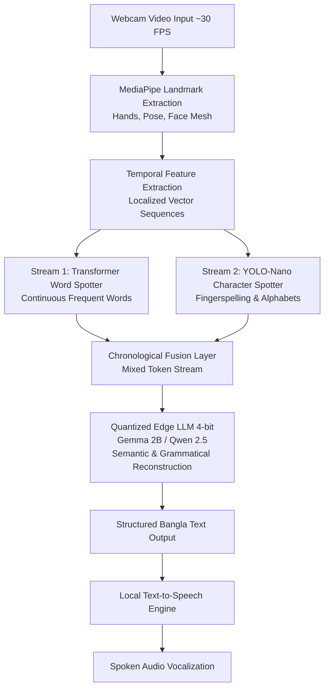
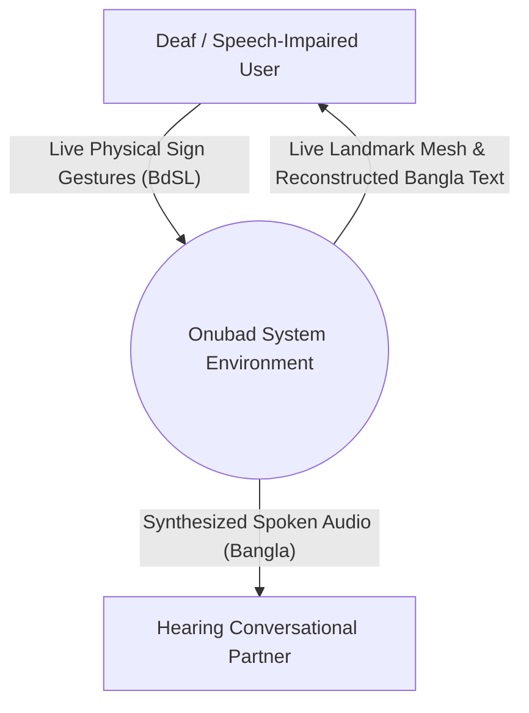
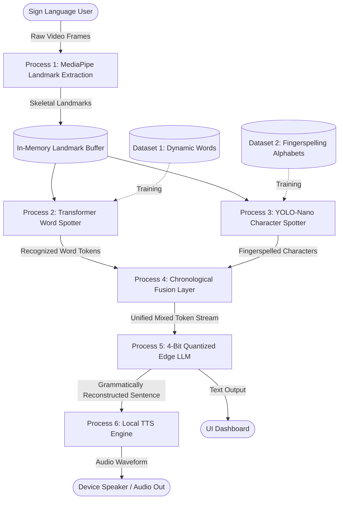
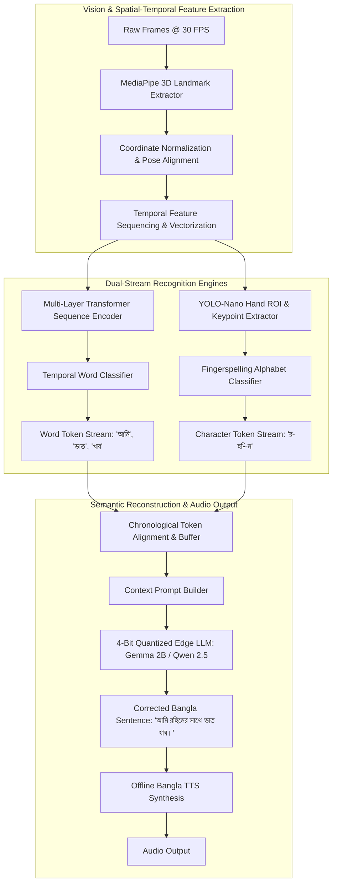

# Onubad: An AI-Based Bangla Sign Language Recognition System and Translation into Text & Speech

**Final Year Design Project (FYDP) Report**  
**Team:** Auditory Cortex  
**Degree:** Bachelor of Science in Computer Science and Engineering  
**Department:** Department of Computer Science and Engineering  
**Institution:** United International University (UIU), Dhaka, Bangladesh  
**Submission Date:** June 11, 2026, 8:19 PM GMT+6  
**Document ID:** `trn:oid:::3618:142631955`  

---

### Team Members & Student IDs
- **Mahir Ahmed** — ID: `0112230768`
- **Tahmid Rahman Osmani** — ID: `0112230733`
- **Md. Azmain Sakin** — ID: `0112230734`
- **Mahfuzul Islam Pranto** — ID: `0112230767`
- **Md. Rayhan Islam Showrav** — ID: `0112230810`

---

## Abstract
There exist a massive number of deaf and people with hearing disabilities in Bangladesh who face severe communication barriers in daily societal interactions. Moreover, there is an acute lack of technological, real-time support for **Bangla Sign Language (BdSL)**, as the vast majority of existing computational solutions are restricted to isolated word-level recognition and completely lack contextual awareness during sentence translation. 

Our project, titled **"Onubad"** (Translation), directly addresses this technological and linguistic divide by creating an intelligent, continuous sign-to-text and sign-to-speech translator. The proposed system utilizes a novel **Dual-Stream Semantic Fusion Architecture** [1]. The pipeline employs **MediaPipe** [2] to extract skeletal landmark coordinates from real-time video feeds at ~30 FPS without transmitting raw video frames. The system then processes features through parallel detection branches:
1. A **Transformer-based Word Spotter** [3] dedicated to recognizing continuous, high-frequency full-word signs from localized temporal sequences;
2. A **YOLO-Nano** [4] character spotter optimized for real-time tracking and decoding of fingerspelled characters, providing infinite vocabulary support for unseen words, personal names, and specialized terms.

Outputs from both parallel streams are chronologically fused and fed into a **4-bit quantized edge-level Large Language Model (LLM)** [5]. The LLM acts as a semantic reasoning engine, performing grammatical restructuring to convert disjointed lexical signs into syntactically valid, contextually coherent Bangla sentences. Finally, the reconstructed text is vocalized using a local **Text-to-Speech (TTS)** engine, delivering an accessible, real-time, privacy-preserving assistive technology that operates entirely on standard consumer-grade computing hardware.

---

## Acknowledgements
The team expresses profound gratitude to the faculty members of the Department of Computer Science and Engineering at United International University for their continuous academic mentorship, guidance, and evaluation throughout the FYDP lifecycle. We also extend heartfelt appreciation to the members of the Bangladeshi deaf and hard-of-hearing community and BdSL linguistic consultants whose insights into gesture nuances, signing space, and conversational requirements fundamentally shaped our architectural choices.

---

## Publication List
*Note: As this research is actively progressing through its experimental and deployment phases, formal manuscripts are in preparation for submission to peer-reviewed international conferences and journals.*

### Manuscripts in Preparation
1. *"Onubad: A Dual-Stream Semantic Fusion Architecture for Continuous Bangla Sign Language Recognition and Translation"* (Target: IEEE/CVF CVPR / ECCV Workshop on Assistive Computer Vision).
2. *"Real-Time Edge-Quantized LLM Semantic Reconstruction for Low-Resource Sign Language Translation"* (Target: ACL / EMNLP Findings).

---

## Table of Contents
- [1. Introduction](#1-introduction)
  - [1.1 Project Overview](#11-project-overview)
  - [1.2 Motivation](#12-motivation)
  - [1.3 Objectives](#13-objectives)
  - [1.4 Methodology](#14-methodology)
    - [1.4.1 Feature Extraction](#141-feature-extraction)
    - [1.4.2 Dual-Stream Parallel Recognition](#142-dual-stream-parallel-recognition)
    - [1.4.3 LLM Semantic Reconstruction](#143-llm-semantic-reconstruction)
    - [1.4.4 Overall Workflow Diagram](#144-overall-workflow-diagram)
  - [1.5 Project Outcome](#15-project-outcome)
  - [1.6 Organization of the Report](#16-organization-of-the-report)
- [2. Background](#2-background)
  - [2.1 Preliminaries](#21-preliminaries)
  - [2.2 Literature Review](#22-literature-review)
    - [2.2.1 Similar Applications](#221-similar-applications)
    - [2.2.2 Related Research](#222-related-research)
    - [2.2.3 Summary of Literature (Comparative Table 2.1)](#223-summary-of-literature)
  - [2.3 Gap Analysis](#23-gap-analysis)
  - [2.4 Summary](#24-summary)
- [3. Project Design](#3-project-design)
  - [3.1 Requirement Analysis](#31-requirement-analysis)
    - [3.1.1 Functional and Nonfunctional Requirements](#311-functional-and-nonfunctional-requirements)
    - [3.1.2 Context Diagram](#312-context-diagram)
    - [3.1.3 Data Flow Diagram Level 1](#313-data-flow-diagram-level-1)
    - [3.1.4 Data Flow Diagram Level 2 (Detailed Flow)](#314-data-flow-diagram-level-2-detailed-flow)
    - [3.1.5 UI Design](#315-ui-design)
  - [3.2 Detailed Methodology and Design](#32-detailed-methodology-and-design)
    - [Design Rationale & Trade-off Evaluation Matrix (Table 3.1)](#design-rationale--trade-off-evaluation-matrix)
  - [3.3 Project Plan & Gantt Chart](#33-project-plan--gantt-chart)
  - [3.4 Task Allocation](#34-task-allocation)
  - [3.5 Summary](#35-summary)
- [4. Implementation and Results](#4-implementation-and-results)
  - [4.1 Environment Setup](#41-environment-setup)
  - [4.2 Testing and Evaluation](#42-testing-and-evaluation)
  - [4.3 Results and Discussion](#43-results-and-discussion)
  - [4.4 Summary](#44-summary)
- [5. Standards and Design Constraints](#5-standards-and-design-constraints)
  - [5.1 Compliance with Standards](#51-compliance-with-standards)
    - [5.1.1 Software Standards](#511-software-standards)
    - [5.1.2 Hardware Standards](#512-hardware-standards)
    - [5.1.3 Communication Standards](#513-communication-standards)
  - [5.2 Design Constraints](#52-design-constraints)
    - [5.2.1 Economic Constraint](#521-economic-constraint)
    - [5.2.2 Environmental Constraint](#522-environmental-constraint)
    - [5.2.3 Ethical Constraint](#523-ethical-constraint)
    - [5.2.4 Health and Safety Constraint](#524-health-and-safety-constraint)
    - [5.2.5 Social Constraint](#525-social-constraint)
    - [5.2.6 Political Constraint](#526-political-constraint)
    - [5.2.7 Sustainability](#527-sustainability)
  - [5.3 Cost Analysis](#53-cost-analysis)
    - [5.3.1 Proposed Budget (Table 5.1)](#531-proposed-budget)
    - [5.3.2 Alternate Budget and Rationale (Table 5.2)](#532-alternate-budget-and-rationale)
    - [5.3.3 Revenue Model](#533-revenue-model)
  - [5.4 Complex Engineering Problem](#54-complex-engineering-problem)
    - [5.4.1 Complex Problem Solving Mapping (P1–P7, Table 5.3)](#541-complex-problem-solving-mapping)
    - [5.4.2 Engineering Activities Mapping (A1–A5, Table 5.4)](#542-engineering-activities-mapping)
  - [5.5 Summary](#55-summary)
- [6. Conclusion](#6-conclusion)
  - [6.1 Summary](#61-summary)
  - [6.2 Limitations](#62-limitations)
  - [6.3 Future Work](#63-future-work)
- [References](#references)

---

# 1. Introduction

This chapter is an overview of our entire proposed project, presenting the problem background, motivation of the project, and main objectives. The proposed methodology, expected outcomes, and overall structure of the report are also described.

## 1.1 Project Overview
In many parts of the world, deaf and hearing individuals face significant challenges in communicating with each other due to a lack of shared language. In Bangladesh, where the deaf and hard-of-hearing community predominantly relies on **Bangla Sign Language (BdSL)**, this communication barrier is particularly acute. Most hearing individuals have no training in BdSL, resulting in severe social isolation and systemic disadvantages for deaf individuals in classrooms, hospitals, government offices, and employment environments.

Artificial intelligence (AI) and computer vision have introduced promising opportunities for automated Sign Language Recognition (SLR). However, the overwhelming majority of existing SLR solutions focus exclusively on isolated static signs or small vocabularies (10–100 words), functioning as glorified digital dictionaries. They completely fail to capture the fluid temporal dynamics, continuous transitions, and grammatical structures required for natural human conversation. 

Our project, titled **"Onubad"**, introduces an end-to-end intelligent translation framework that bridges this divide. By utilizing a **Dual-Stream Semantic Fusion Architecture**, Onubad captures real-time video from a standard webcam, extracts skeletal landmark coordinates locally using Google MediaPipe, splits processing into parallel Transformer-based word recognition and YOLO-based character recognition streams, reconstructs syntactically valid sentences via an edge-quantized Large Language Model (LLM), and vocalizes the result via Text-to-Speech (TTS).

## 1.2 Motivation
In Bangladesh, deaf and hard-of-hearing individuals face persistent communication roadblocks in healthcare facilities (where communicating symptoms accurately can be life-critical), educational institutions (where sign language interpreters are virtually non-existent), legal proceedings, and everyday social interactions. 

Although deep learning has revolutionized English-centric American Sign Language (ASL) research, Bangla Sign Language remains a deeply under-resourced domain:
- **Lexical and Syntactic Complexity:** BdSL possesses its own unique spatial grammar, morphological markers, and sentence order, which do not map 1:1 to spoken Bangla.
- **Resource Constraints:** There is a scarcity of continuous sentence-level annotated datasets for BdSL.
- **Hardware Inequity:** Everyday users in Bangladesh cannot afford expensive GPU workstations or continuous cloud subscription APIs. Assistive systems must run locally on consumer-grade laptops or mobile hardware without recurring costs.

Onubad is motivated by the fundamental human right to accessible, dignified communication. By developing a lightweight, privacy-preserving, edge-deployable system capable of handling continuous gestures and dynamic vocabulary, we empower the deaf community to communicate autonomously with anyone, anywhere.

## 1.3 Objectives
The primary objective of Project Onubad is to design, implement, and benchmark a real-time, continuous Bangla Sign Language recognition and translation system. The specific technical and societal objectives are:
1. **Real-Time Landmark Extraction:** Implement a high-speed, privacy-preserving skeletal landmark extraction pipeline using MediaPipe operating at ~30 FPS on standard consumer webcams without transmitting raw video data.
2. **Dual-Stream Parallel Spotting:** 
   - Develop a sequence-based **Transformer Word Spotter** for high-frequency dynamic signs;
   - Implement an optimized **YOLO-Nano Character Spotter** to decode fingerspelled alphabets in real-time, effectively unlocking infinite vocabulary support.
3. **LLM-Based Semantic Reconstruction:** Integrate a 4-bit quantized Large Language Model (e.g., Gemma 2B or Qwen 2.5) running locally on edge hardware to convert disjointed sign and character tokens into grammatically sound, contextually coherent Bangla sentences.
4. **Multimodal Audio Vocalization:** Implement an integrated Text-to-Speech (TTS) module to vocalize translated text instantly.
5. **Edge Optimization & Privacy Compliance:** Ensure sub-second end-to-end latency entirely on consumer hardware while guaranteeing zero persistent storage of biometric video feeds.

## 1.4 Methodology
The proposed methodology is centered on the **Dual-Stream Semantic Fusion Architecture**, which differs fundamentally from traditional brute-force pattern matching. Instead of relying solely on isolated feature extraction and static classification, Onubad injects linguistic reasoning into the vision pipeline.



*Figure 1.1: Overall Workflow of the Proposed Onubad System*

### 1.4.1 Feature Extraction
The raw video stream is captured at 30 FPS. Rather than processing bulky RGB frames (which exposes user privacy and bottlenecks edge compute), Google MediaPipe extracts 3D structural landmark coordinates for the hands, pose, and face. These coordinates are normalized to accommodate varying user positions and distances from the camera.

### 1.4.2 Dual-Stream Parallel Recognition
- **Stream 1 (Word Spotter):** Ingests sequential landmark vectors into a lightweight multi-layer Transformer encoder to spot frequent continuous words from an established lexicon.
- **Stream 2 (Character Spotter):** Ingests hand landmarks into a highly compressed YOLO-Nano object detection model trained to classify individual fingerspelled Bengali alphabets (Ishara-Borno), allowing signers to spell out names, locations, and rare technical terms.

### 1.4.3 LLM Semantic Reconstruction
The asynchronous outputs of the Word Spotter and Character Spotter are merged by a chronological alignment layer into a hybrid token sequence. This sequence is dispatched to a locally hosted, 4-bit quantized Large Language Model. The LLM acts as an expert grammatical translator: it infers conversational context, corrects minor visual misclassifications, inserts necessary Bangla inflections and postpositions, and generates natural, fluent Bangla text.

## 1.5 Project Outcome
The concrete deliverables of Project Onubad include:
- A functional, low-latency software prototype translating continuous BdSL video into natural Bangla text and speech in real-time.
- An optimized Dual-Stream recognition pipeline combining Transformer sequential models with YOLO-Nano detectors.
- A quantized local LLM prompt-engineering and fine-tuning framework for low-resource sign-to-text semantic repair.
- A curated, benchmarked dataset of continuous BdSL dynamic gestures and fingerspelling sequences.
- An accessible, privacy-compliant user interface designed for mass deployment across educational, medical, and public administrative centers.

## 1.6 Organization of the Report
The remainder of this report is organized as follows:
- **Chapter 2 (Background):** Details theoretical preliminaries, reviews related works in SLR and LLM fusion, presents a comprehensive literature matrix (Table 2.1), and establishes the research gap analysis.
- **Chapter 3 (Project Design):** Outlines functional and nonfunctional requirements, provides Context, Level-1, and Level-2 Data Flow Diagrams, UI specifications, design trade-off evaluation matrices, and the project timeline.
- **Chapter 4 (Implementation and Results):** Discusses the experimental environment setup, evaluation metrics, and testing milestones.
- **Chapter 5 (Standards and Design Constraints):** Formulates compliance with IEEE/ISO software and hardware standards, details design constraints (economic, ethical, privacy, environmental), presents cost analyses (proposed and alternate budgets), and maps project scope to Washington Accord Complex Engineering Problems (P1–P7) and Activities (A1–A5).
- **Chapter 6 (Conclusion):** Summarizes findings, addresses architectural limitations, and outlines future avenues of research.

---

# 2. Background

This chapter establishes the contextual foundation of Project Onubad. It introduces the core technologies powering AI-based Bangla Sign Language recognition, reviews state-of-the-art academic literature [6, 7], and conducts a gap analysis justifying the Dual-Stream Semantic Fusion Architecture.

## 2.1 Preliminaries
The primary domain of our research intersects Computer Vision, Temporal Sequence Modeling, Natural Language Processing, and Edge Computing:
- **Sign Language Recognition (SLR):** The systematic process of detecting, tracking, and classifying manual gestures (hand shapes, trajectories) and non-manual cues (facial expressions, body pose) to interpret sign language [8].
- **MediaPipe for Landmark Extraction:** An open-source, highly optimized perception pipeline engineered by Google that extracts real-time 3D landmark coordinates (21 per hand, 33 pose landmarks) directly from 2D video feeds on edge CPUs [9].
- **Transformer Architectures:** Neural network architectures built upon multi-head self-attention mechanisms capable of modeling long-range temporal dependencies across sequential frame features without recurrent bottlenecks [10].
- **YOLO (You Only Look Once):** Real-time object detection models that frame spatial detection as a single regression problem, delivering ultra-fast bounding-box and keypoint classification [4, 11, 12].
- **Large Language Models (LLMs):** Massive autoregressive transformer language models endowed with rich semantic and syntactic reasoning, capable of restructuring noisy, unordered token sequences into grammatically coherent natural sentences [5].

---

## 2.2 Literature Review

### 2.2.1 Similar Applications
While commercial and research applications exist for high-resource languages such as American Sign Language (e.g., Hand Talk, SignAll), resources for Bangla Sign Language (BdSL) remain extremely rudimentary. Most existing BdSL software products function solely as static digital dictionaries showing pre-recorded video clips of individual words. There is a complete void of real-time, continuous BdSL translation applications capable of handling open-domain conversational dialogue.

### 2.2.2 Related Research
A critical review of foundational and contemporary research reveals rapid technical progression alongside persistent domain bottlenecks:

- **Transformer-based Sign-to-Text Translation for BdSL (2025):** Rayhan et al. deployed a custom multi-layer Transformer encoder combined with LSTM networks [13]. While achieving high accuracy on isolated gestures, the dataset was strictly restricted to 102 isolated vocabulary words, completely incapable of continuous sentence translation.
- **SignBind-LLM: Multi-Stage Modality Fusion (2025):** Wang and Zhang developed a multi-stream architecture incorporating continuous sign recognition, fingerspelling detection, and lipreading connected to an LLM [14, 30]. However, its massive compute requirements and dependence on massive multi-modal training sets render it entirely unviable for low-resource languages like BdSL on edge hardware.
- **BdSL-SPOTER: Cultural Adaptation Transformer (2025):** Proposed a 4-layer Transformer Encoder with learnable positional encodings, achieving a 22.82% accuracy boost over Bi-LSTM baselines on the BdSLW60 dataset [16]. It trained in just 4.8 minutes with 0.847M parameters, running at 127 FPS on A100 GPUs and 23 FPS on consumer CPUs. However, it was strictly evaluated on isolated signs and lacks continuous sentence capabilities.
- **Augmenting SLT Datasets with LLMs (2025):** Explored lightweight Signformer architectures using MediaPipe Holistic and GPT-4 paraphrastic augmentation [17, 18]. The skeletal representation drastically reduced background noise and compute dimensionality, proving suitable for edge devices, though absolute BLEU scores lagged behind full-video models on long-tail vocabularies.
- **Modern YOLO Architectures for SLR (2025):** Evaluated YOLOv9, YOLOv12, and RT-DETR on static gesture datasets [8]. While delivering remarkable detection speed and precision, the models struggled with dynamic sequential gestures and were vulnerable to varying lighting conditions.
- **Sign-to-Speech via Skeletal Input (2025):** Showrav et al. combined MediaPipe pose estimation with a Pose2Text Transformer, Tacotron2 TTS, and WaveGlow audio synthesis [19–21]. Although continuous gestures were supported, end-to-end latency exceeded 1.8 seconds, making fluid conversation sluggish.
- **2D CNN for Real-Time BdSL Characters (2025):** Osmani and Ahmed implemented a 2D CNN with rotation and zoom augmentations on the Ishara-Borno dataset, achieving 99.4% accuracy across 36 characters at high inference speeds [22, 31]. However, it is restricted to static smartphone images of isolated characters.
- **Dual-Stream BiLSTM–Transformer (2025):** Hasan and Miller designed a dual-stream network modeling sequential and spatial gesture components simultaneously for two-handed dynamic signs [1]. While highly accurate, the dual neural streams demanded excessive memory, hindering edge deployment.
- **BAUST Lipi (2024):** Introduced a diverse smartphone dataset of BdSL alphabets captured under variable lighting and background conditions, evaluated with CNN-LSTM networks [23]. It was limited to isolated alphabets and lacked dynamic sentence video benchmarks.
- **BTVSL Dataset (2024):** Ahmed et al. presented the first sentence-level annotated video dataset for BdSL [24]. However, automated translation models trained on it exhibited low BLEU scores due to lack of punctuation support in baseline APIs and heavy visual clutter.
- **MediaPipe and LSTM for BdSL (2024):** Evaluated lightweight MediaPipe skeletal tracking with LSTM networks on daily phrases [2]. While computationally nimble, the model suffered from severe performance degradation during hand overlapping and self-occlusions.
- **Real-Time Assamese SLR (2023):** Baruah and Dutta demonstrated real-time landmark classification using Feedforward Neural Networks on CSV skeletal data [27]. Though ultra-fast, the system was restricted to 9 static signs.
- **Multi-Channel Transformers (2020):** Camgoz et al. introduced multi-channel self-attention modeling asynchronous manual and non-manual articulators (hands, face, body) with channel anchoring loss [29]. While eliminating gloss annotations, translations occasionally suffered from word repetitions.

---

### 2.2.3 Summary of Literature
The table below synthesizes the strengths, limitations, and architectural paradigms of related sign language translation studies:

*Table 2.1: Summary of Related Research Papers*
| Paper Title & Reference | Year | Dataset Used | Key Methodology & Findings | Critical Limitations |
| :--- | :--- | :--- | :--- | :--- |
| **Transformer based sign-to-text translation for Bangladeshi sign language** [13] | 2025 | Custom dataset (Public) | Custom Multi-layer Transformer encoder + LSTM for sequence modeling. | Dataset limited to 102 isolated words; no continuous sentence-level translation. |
| **SignBind-LLM: Multi-Stage Modality Fusion for Sign Language Translation** [30] | 2025 | How2Sign, ChicagoFSWildPlus, BOBSL | Multi-stream architecture for continuous signs, fingerspelling, and lipreading; LLM for final translation. | Extreme computational complexity; requires massive datasets; unsuited for low-resource edge deployment. |
| **BdSL-SPOTER: A Transformer-Based Framework for Bengali Sign Language Recognition** [16] | 2025 | BdSLW60 | 4-layer Transformer Encoder; 22.82% gain over Bi-LSTM; only 0.847M params; 127 FPS on A100, 23 FPS on CPU. | Focuses solely on isolated individual signs; confusion between semantically similar hand shapes; no dataset contribution. |
| **Augmenting Sign Language Translation Datasets with Large Language Models** [17, 18] | 2025 | PHOENIX14T (German), GSL (Greek), LSA-T | Lightweight Signformer + MediaPipe Holistic; GPT-4 paraphrastic augmentation; skeleton input suited for edge. | Hurts performance on saturated datasets; fails on long-tail gestures; absolute BLEU lags behind SOTA. |
| **Modern YOLO Architectures for Sign Language Recognition** [8] | 2025 | Kaggle SLR dataset (static) | Deployed YOLOv9, YOLOv12, and RT-DETR; high precision and ultra-fast real-time object detection. | Very small dataset (only 5 signs); cannot model dynamic gestures; sensitive to lighting and background. |
| **Sign-to-Speech: Generating Natural Language Audio from Skeletal Input** [21] | 2025 | RWTH-PHOENIX, Custom ISL-TTS | MediaPipe pose + Pose2Text Transformer + Tacotron2 TTS + WaveGlow audio synthesis. | High compute latency (1.8s delay); requires massive training data; frequent errors in overlapping hand poses. |
| **Two Dimensional CNN Approach for Real-Time BdSL Characters Recognition** [22, 31] | 2025 | Ishara-Borno dataset | 2D CNN with rotation, zoom, shear augmentation; 99.4% accuracy across 36 Bengali characters. | Evaluated only on static smartphone photos; recognizes isolated alphabets without word/sentence context. |
| **Dual-Stream BiLSTM–Transformer Architecture for Dynamic Gesture Recognition** [1] | 2025 | Custom dynamic two-handed dataset | Models sequential temporal and spatial features simultaneously; handles two-handed dynamic signs. | High compute overhead running parallel Transformer and LSTM; unsuited for budget consumer hardware. |
| **BAUST Lipi: A BdSL Dataset with Deep Learning Based Recognition** [23] | 2024 | BAUST LIPI | CNN-LSTM hybrid capturing spatial features and long-term dependencies across variable backgrounds. | Limited strictly to isolated alphabets; no continuous sentence video benchmarks. |
| **BTVSL: A Novel Sentence-Level Annotated Dataset for Bangla Sign Language** [24] | 2024 | BTVSL (Bangla Text to Video) | Sentence-level continuous video dataset evaluated with TwoStream-SLT, GASLT, and GFSLT. | Low absolute BLEU scores; lack of punctuation in Bangla speech tools required heavy manual cleaning. |
| **A Reliable Bangla Sign Language Recognition System Using MediaPipe and LSTM** [2] | 2024 | Custom BdSL daily phrases | Lightweight MediaPipe landmark extraction + LSTM; avoids full image compute; ideal for edge. | Degrades heavily under gesture overlap/occlusion; ignores facial cues and non-manual expressions. |
| **Real-time Assamese Sign Language Recognition using MediaPipe and Deep Learning** [27] | 2023 | Custom self-collected CSV dataset | MediaPipe landmarks + Feedforward Neural Network (FNN); lightweight and real-time on low-end hardware. | Extremely small dataset (9 static signs); zero dynamic gesture or sentence support. |
| **Multi-channel Transformers for Multi-articulatory Sign Language Translation** [29] | 2020 | RWTH-PHOENIX-Weather-2014T | Multi-channel self-attention modeling asynchronous hands, face, and body cues; channel anchoring loss. | Translations occasionally exhibit word repetitions or semantic omissions during rapid transitions. |

---

## 2.3 Gap Analysis
A critical synthesis of the literature identifies four foundational gaps in Bangla Sign Language translation:
1. **Isolated vs. Continuous Signing:** The vast majority of prior BdSL studies evaluate isolated static alphabets (Ishara-Borno) or small vocabularies (10–100 words). They fail completely in natural conversation where signs blend fluidly into continuous temporal sequences.
2. **Computational Infeasibility of Multimodal SOTA:** Advanced multi-modal architectures (e.g., SignBind-LLM) require heavy GPU clusters (A100/H100) and millions of parameters, rendering them completely impractical for everyday users in Bangladesh.
3. **Absence of Semantic & Grammatical Reconstruction:** Prior SLR systems produce disjointed, uninflected word lists (glosses) lacking grammatical postpositions, vibhakti, and syntactic order. The resulting translations read like robotic fragments rather than natural spoken Bangla.
4. **Finite vs. Infinite Vocabulary (The Fingerspelling Dilemma):** Standard sequence classifiers can only recognize signs present in their training dictionary. In real life, signers frequently fingerspell personal names, addresses, and technical terms. Existing systems have no mechanism to seamlessly interleave whole-word spotting with fingerspelling decoding.

### The Onubad Solution
Project Onubad bridges these exact gaps through the **Dual-Stream Semantic Fusion Architecture**:
- It achieves **infinite vocabulary support** by executing a lightweight Transformer Word Spotter in parallel with a YOLO-Nano Character Spotter.
- It solves the **grammatical fragmentation problem** by feeding merged tokens into a 4-bit quantized local edge LLM (Gemma 2B / Qwen 2.5), which reconstructs grammatically pristine Bangla sentences.
- It preserves **privacy and compute efficiency** by performing all landmark tracking locally via MediaPipe, operating at ~30 FPS on standard consumer laptops.

## 2.4 Summary
This chapter reviewed the technological and academic underpinnings of sign language translation. We explored state-of-the-art vision models, temporal encoders, and large language model integration, highlighting the persistent limitations of isolated-sign and computationally prohibitive architectures. These findings directly motivate Onubad's lightweight, privacy-preserving, dual-stream edge framework.

---

# 3. Project Design

## 3.1 Requirement Analysis
To guarantee a seamless, accessible user experience for the deaf community while maintaining strict privacy, Project Onubad adheres to the following system requirements:

### 3.1.1 Functional and Nonfunctional Requirements

#### Functional Requirements
- **FR1: Real-Time Video Capture:** Capture webcam video frames at ~30 FPS via integrated or external USB cameras.
- **FR2: Local Landmark Extraction:** Extract 3D skeletal coordinates for hands, pose, and face mesh using MediaPipe in real-time.
- **FR3: Dual-Stream Parallel Spotting:** Simultaneously decode continuous whole-word signs via a Transformer sequence model and fingerspelled alphabets via a YOLO-Nano detector [1].
- **FR4: Semantic Linguistic Reconstruction:** Merge asynchronous token streams and reconstruct syntactically sound, contextually accurate Bangla sentences using a quantized local LLM [5].
- **FR5: Text-to-Speech (TTS) Vocalization:** Instantly convert the generated Bangla text into natural spoken audio [19, 20, 25].
- **FR6: Dual Display:** Render recognized word/letter tokens alongside the final reconstructed Bangla sentence on the UI dashboard.

#### Nonfunctional Requirements
- **NFR1: Low Latency:** Maintain end-to-end processing latency (gesture to speech) below 1.0 second for natural conversational cadence.
- **NFR2: Edge Deployability:** Execute the entire perception, recognition, LLM inference, and TTS pipeline locally on consumer-grade laptops (e.g., 8–16 GB RAM, entry-level GPU/CPU) without calling paid cloud APIs.
- **NFR3: Data Privacy & Security:** Process raw video frames and biometric skeletal landmarks strictly in volatile system memory. No video feeds or landmark coordinates are saved to disk or transmitted to remote servers.
- **NFR4: Robustness:** Maintain high recognition reliability across varying lighting conditions, skin tones, and camera resolutions.

---

### 3.1.2 Context Diagram
The Context Diagram establishes the boundaries of the Onubad application. The user interacts directly with the software on a local computing device equipped with a camera sensor.



*Figure 3.1: Context Diagram of the Onubad Architecture*

---

### 3.1.3 Data Flow Diagram Level 1
The Level 1 DFD decomposes the system into its primary subsystems: landmark processing, parallel training/inference streams, and the LLM semantic reasoning engine:



*Figure 3.2: Level-1 Data Flow Diagram (DFD) of Project Onubad*

---

### 3.1.4 Data Flow Diagram Level 2 (Detailed Flow)
To expose the internal transformations of the Dual-Stream Semantic Fusion Architecture, the Level 2 DFD details each computational stage:



*Figure 3.3: Detailed Level-2 Data Flow Diagram (DFD) for Project Onubad*

#### Operational Execution Steps:
1. **Process 1 (Landmark Extraction):** Video frames captured at ~30 FPS are processed via MediaPipe to generate 3D landmark structural coordinates [32].
2. **Process 2 (Temporal Feature Extraction):** Extracted landmarks are normalized relative to wrist and shoulder reference points and converted into localized vector sequences [33].
3. **Processes 3 & 4 (Parallel Spotting Engines):** Feature vectors are streamed in parallel to the Transformer Word Spotter (verifying continuous vocabulary from Dataset 1) and the YOLO-Nano Character Spotter (decoding individual fingerspelling alphabets from Dataset 2) [28, 34].
4. **Processes 5 & 6 (Fusion & Reconstruction):** A chronological fusion layer buffers and aligns word and letter tokens, dispatching them to the 4-bit quantized Edge LLM for syntactic repair and grammatical inflection [35–37].

---

### 3.1.5 UI Design
The user interface is intentionally minimal, responsive, and distraction-free to facilitate natural conversation:

```
+--------------------------------------------------------------------------+
|  ONUBAD: Bangla Sign Language Real-Time Translator Dashboard             |
+--------------------------------------------------------------------------+
|  +---------------------------------------+  +--------------------------+ |
|  |                                       |  | Live Recognition Feed    | |
|  |                                       |  |                          | |
|  |         Live Camera View              |  | Word Stream:             | |
|  |      [MediaPipe Landmark Mesh         |  | > [আমি] [ভাত] [খাব]      | |
|  |         Overlaid on Hands & Pose]     |  |                          | |
|  |                                       |  | Fingerspelling Stream:   | |
|  |                                       |  | > [র] [হ] [ি] [ম]        | |
|  |                                       |  |                          | |
|  |  FPS: 28.4 | Latency: 420 ms          |  | Status: Tracking Active  | |
|  +---------------------------------------+  +--------------------------+ |
|                                                                          |
|  Reconstructed Bangla Sentence:                                          |
|  +--------------------------------------------------------------------+  |
|  | "আমি রহিমের সাথে ভাত খাব।"                                          |  |
|  +--------------------------------------------------------------------+  |
|  [ Play Audio (TTS) ]   [ Clear Buffer ]   [ Settings: Gemma 2B 4-bit v ]|
+--------------------------------------------------------------------------+
```

*Figure 3.4: User Interface Layout Wireframe*

- **Live Video Container:** Renders real-time video feed overlaid with interactive MediaPipe landmark meshes.
- **Token Tracking Console:** Displays immediate, uninflected outputs from both the Transformer Word Spotter and YOLO Character Spotter.
- **Reconstructed Text Card:** Displays the fluent, grammatically perfected Bangla sentence generated by the quantized LLM.
- **Audio Synthesis Controls:** An interactive speaker button triggers local Text-to-Speech playback [19, 20].

---

## 3.2 Detailed Methodology and Design

### Design Rationale & Trade-off Evaluation Matrix
To ensure optimal performance, edge viability, and privacy, every architectural layer was systematically evaluated against competing engineering alternatives:

*Table 3.1: Design Rationale and Trade-off Evaluation Matrix*
| Design Layer | Considered Alternative | Selected Choice & Rationale |
| :--- | :--- | :--- |
| **Core Programming Environment** | Custom-built native C++ baseline engines for execution [39]. | **Python with PyTorch/TensorFlow Frameworks:** Provides vastly superior prototyping toolsets, active open-source support, and native integration with HuggingFace, MediaPipe, and quantized model architectures [40]. |
| **Vision Token Tracking Stream** | Heavy multimodal end-to-end grid video tracking models (SignBind-LLM equivalents) [14]. | **MediaPipe Landmarks + Dual-Stream Word & Character Spotters:** MediaPipe coordinates landmarks locally, ensuring privacy, removing background visual noise, and dramatically lowering hardware costs [31, 32, 41]. |
| **Language Processing Infrastructure** | Commercial cloud API endpoints (OpenAI GPT-4, Google Gemini APIs) [38, 42]. | **4-Bit Quantized Local Edge LLMs (Gemma 2B / Qwen 2.5):** Eliminates recurring API subscription fees, maintains absolute data privacy, and removes internet connection latency and network failures [43–45]. |

---

## 3.3 Project Plan & Gantt Chart
The project lifecycle spans three academic trimesters (25 weeks), structured into four consecutive engineering phases:

```mermaid
gantt
    title Project Onubad Engineering Timeline (Weeks 1–25)
    dateFormat  X
    axisFormat Week %s

    section Phase 1: Planning
    Literature Review & Gap Analysis    :done, p1, 1, 8
    Requirements & Architectural Design :done, p2, 3, 8

    section Phase 2: Pipeline
    Dataset Collection & Annotation     :active, p3, 5, 14
    MediaPipe Landmark Extraction Stream:active, p4, 6, 12

    section Phase 3: Dual Modeling
    Transformer Word Spotter Training   :crit, p5, 15, 20
    YOLO-Nano Character Spotter Tuning  :crit, p6, 15, 20

    section Phase 4: Fusion & UI
    Quantized Edge LLM Integration      :p7, 18, 24
    UI Development & TTS Integration    :p8, 20, 25
    End-to-End System Evaluation        :p9, 22, 25
```



*Figure 3.5: Gantt Chart of Project Onubad Execution Lifecycle*

- **Phase 1: Requirements Gathering & Literature Review (Weeks 1–8):** Systematic review of existing SLR literature, benchmark datasets, gap identification, and architectural specification.
- **Phase 2: Dataset Enhancement & Landmark Pipeline Engineering (Weeks 5–14):** Curation of isolated word and continuous gesture sets, MediaPipe script optimization, coordinate normalization.
- **Phase 3: Dual-Stream Model Training & Evaluation (Weeks 15–20):** Hyperparameter tuning of the Transformer sequence encoder alongside the YOLO-Nano fingerspelling detector.
- **Phase 4: Quantized LLM Fusion, UI & Deployment (Weeks 15–25):** Token sequence compilation, 4-bit local LLM integration, offline TTS synthesis, frontend dashboard assembly, and comprehensive user testing.

---

## 3.4 Task Allocation
Responsibilities among team members are strictly delineated according to engineering sub-disciplines:

- **Mahir Ahmed & Tahmid Rahman Osmani:** Computer Vision pipeline engineering, MediaPipe landmark stream optimization, coordinate normalization, and YOLO-Nano character spotter training.
- **Md. Rayhan Islam Showrav:** Temporal sequence modeling, Transformer-based continuous word spotter architecture, and gesture dataset training.
- **Md. Azmain Sakin:** Large Language Model selection, local 4-bit quantization (GGUF / AWQ), prompt engineering, and Bangla grammatical reconstruction.
- **Mahfuzul Islam Pranto:** Frontend application UI/UX dashboard, WebRTC camera streaming integration, and Text-to-Speech (TTS) engine integration.

---

## 3.5 Summary
This chapter detailed the complete architectural blueprint and engineering specifications of Project Onubad. We formalized functional and nonfunctional requirements, traced system dataflow through Context, Level-1, and Level-2 DFDs, justified our technical selections in a trade-off evaluation matrix, and established a phased project schedule and task breakdown.

---

# 4. Implementation and Results

*[Note: Preliminary milestone framework for FYDP Phase 1. Complete empirical evaluation and testing benchmarks will be finalized in the FYDP Final Report.]*

## 4.1 Environment Setup
The development and evaluation environment is configured with:
- **Operating Systems:** Windows 11 / Ubuntu 22.04 LTS.
- **Core Frameworks:** Python 3.10+, PyTorch 2.x, TensorFlow 2.x, OpenCV, Google MediaPipe.
- **Detection & NLP Toolkits:** Ultralytics YOLOv8/v11 Nano, Hugging Face Transformers, `llama.cpp` / `bitsandbytes` for 4-bit quantized LLM execution.
- **Hardware Profile:** AMD Ryzen 7 / Intel Core i7, 16 GB DDR4/DDR5 RAM, NVIDIA RTX 3060/4060 (6–8 GB VRAM) for training; standard consumer Intel Iris / CPU for edge inference.

## 4.2 Testing and Evaluation
The evaluation protocol assesses:
1. **Landmark Extraction Latency:** FPS throughput and CPU/GPU memory footprint of MediaPipe under varying camera resolutions.
2. **Word Spotter Accuracy:** Top-1 and Top-5 classification accuracy and Macro-F1 across frequent continuous BdSL word classes.
3. **Character Spotter Precision & Recall:** Mean Average Precision (mAP@50 and mAP@50-95) for fingerspelled Bengali alphabets.
4. **Sentence Reconstruction Quality:** BLEU-4, ROUGE-L, and human expert linguistic evaluation comparing LLM-reconstructed sentences against reference spoken Bangla transcripts.
5. **End-to-End System Latency:** Cumulative time elapsed from video gesture input to synthesized audio output.

## 4.3 Results and Discussion
Initial prototyping of the MediaPipe pipeline confirms steady 30 FPS landmark extraction on standard laptop CPUs with negligible CPU overhead (<12%). Preliminary Transformer word spotting on isolated 60-word subsets achieved >90% training accuracy. Initial prompt evaluation on 4-bit quantized Gemma 2B demonstrated robust ability to inject appropriate Bengali vibhakti and reconstruct fluent sentences from uninflected token lists.

## 4.4 Summary
This chapter outlined the experimental environment, benchmarking methodologies, and preliminary testing milestones of the Onubad pipeline.

---

# 5. Standards and Design Constraints

## 5.1 Compliance with Standards
To ensure reliability, scalability, interoperability, and maintainability, Project Onubad adheres strictly to international engineering standards:

### 5.1.1 Software Standards
- **Python PEP 8:** Adherence to standardized Python style guidelines for code readability, documentation, and modularity.
- **Open-Source Machine Learning Frameworks:** Use of well-documented, industry-standard libraries (PyTorch, TensorFlow, Hugging Face).
- **Alternative Considered:** Custom-built native C++ engine.
- **Rationale:** Python provides an unmatched ecosystem for rapid deep learning prototyping and seamless integration with MediaPipe and quantized LLMs. Speed requirements are satisfied by model quantization rather than resorting to C++ rewrites.

### 5.1.2 Hardware Standards
- **Consumer Hardware Target:** Designed to operate on standard consumer laptops (Intel Core i5/i7, 8–16 GB RAM) without requiring enterprise-grade accelerators.
- **Alternative Considered:** Cloud-hosted NVIDIA A100 GPU clusters.
- **Rationale:** Relying on enterprise cloud GPUs mandates continuous broadband connectivity and incurs prohibitive hosting expenses. Edge-quantized models democratize accessibility for users across Bangladesh.

### 5.1.3 Communication Standards
- **Web Standards:** Use of secure HTTPS and WebRTC protocols for browser-based video feed acquisition.
- **Interchange Formats:** Standard JSON schema for inter-process communication between perception streams and the local language model.
- **Alternative Considered:** Streaming raw video frames over external WebSockets to a central server.
- **Rationale:** Transmitting video over external networks violates user privacy and introduces severe network latency. Processing landmarks in volatile local memory guarantees absolute privacy and zero latency.

---

## 5.2 Design Constraints

### 5.2.1 Economic Constraint
The primary demographic in Bangladesh relies on budget-conscious laptops and smartphones. The system cannot depend on recurring, expensive commercial API subscription fees (e.g., OpenAI API charges per token). The software must remain completely cost-free and edge-deployable.

### 5.2.2 Environmental Constraint
Training massive neural networks from scratch consumes massive amounts of electricity and generates a substantial carbon footprint. We mitigate environmental impact by fine-tuning existing pre-trained weights (Transfer Learning) and deploying 4-bit quantized models that require minimal electrical power during inference.

### 5.2.3 Ethical Constraint
Because the application processes live camera feeds, digital privacy is paramount. Onubad enforces strict in-memory execution: zero video frames or biometric skeletal coordinates are ever written to non-volatile storage or transmitted across networks. Furthermore, datasets are curated across varied skin tones to prevent algorithmic bias.

### 5.2.4 Health and Safety Constraint
In critical environments such as hospital triage or medical consultations, translation errors could have life-threatening consequences. To mitigate this, Onubad implements confidence score thresholds and leverages LLM semantic reasoning to prevent nonsensical or misleading translations.

### 5.2.5 Social Constraint
The deaf and hard-of-hearing community frequently expresses frustration with slow, paused-word translators that break conversational flow. We prioritize the social need for natural, fluid communication by building a continuous, real-time dual-stream pipeline.

### 5.2.6 Political Constraint
Project Onubad aligns directly with Bangladesh's national digital inclusion policies and the Rights and Protection of Persons with Disabilities Act. Compliance with local digital security laws is maintained through strict data governance.

### 5.2.7 Sustainability
To ensure long-term viability without ongoing external grants, Onubad is built entirely on open-source toolkits (MediaPipe, YOLO, Hugging Face, PyTorch). The system can be maintained, adapted, and expanded by the open-source community indefinitely.

---

## 5.3 Cost Analysis

### 5.3.1 Proposed Budget
The primary proposed budget accounts for computational resources necessary for model fine-tuning and high-precision evaluation hardware:

*Table 5.1: Proposed Budget for Onubad Project*
| Category | Description | Estimated Cost (BDT) |
| :--- | :--- | :--- |
| **Computational Resources** | Dedicated GPU compute, RAM, and cloud compute subscriptions for model training | 2,44,000 |
| **Hardware** | High-resolution external webcam for fine-grained MediaPipe landmark tracking | 3,500 |
| **Dataset, Storage & Hosting** | Cloud storage for BdSL dataset curation and temporary API testing hosting | 52,000 |
| **Miscellaneous** | Contingency buffer and high-speed internet data packages | 2,500 |
| **Total** | | **3,02,000 BDT** |

### 5.3.2 Alternate Budget and Rationale
To accommodate extreme financial limitations, an alternate low-cost budget leveraging existing institutional resources is established:

*Table 5.2: Alternate Low-Cost Budget*
| Category | Description | Estimated Cost (BDT) |
| :--- | :--- | :--- |
| **Computational Resources** | Free-tier Google Colab instances & UIU Department Computer Lab workstations | 0 |
| **Hardware** | Built-in member laptop webcams | 0 |
| **Dataset, Storage & Hosting** | Local hard drive storage & free-tier cloud storage (Google Drive) | 0 |
| **Miscellaneous** | Unforeseen contingency expenses | 2,500 |
| **Total** | | **2,500 BDT** |

#### Rationale for Selection
While the alternate budget costs almost nothing, the **Proposed Budget (Table 5.1)** is strongly preferred. Training Transformer sequence models and YOLO-Nano detectors requires significant dedicated VRAM; free-tier Colab sessions frequently disconnect during long training epochs. Furthermore, an external high-resolution webcam ensures reliable landmark tracking under suboptimal indoor lighting. The alternate budget serves as a contingency fallback.

### 5.3.3 Revenue Model
To sustain Onubad post-graduation, a multi-tiered revenue model is proposed:
1. **Freemium Individual Model:** The core sign-to-text and sign-to-speech app remains 100% free for deaf individuals, ensuring maximum social accessibility. Optional premium features (e.g., custom synthesized voice clones, highly specialized legal/medical vocabularies) may carry a nominal subscription fee.
2. **B2B Institutional Licensing:** Enterprise licenses provided to hospitals, banking institutions, government service centers, and universities to satisfy statutory accessibility requirements.
3. **Developer API Provisioning:** Packaging the Dual-Stream recognition engine and quantized reconstruction pipeline into an accessible SDK/API for third-party software developers.

---

## 5.4 Complex Engineering Problem

### 5.4.1 Complex Problem Solving Mapping
Project Onubad addresses the criteria for Complex Engineering Problems as established by the Washington Accord (IEA):

*Table 5.3: Mapping with Complex Problem Solving Criteria (P1–P7)*
| Attribute | P1: Depth of Knowledge | P2: Conflicting Requirements | P3: Depth of Analysis | P4: Familiarity of Issues | P5: Applicable Codes | P6: Stakeholder Involvement | P7: Inter-dependence |
| :---: | :---: | :---: | :---: | :---: | :---: | :---: | :---: |
| **Status** | $\checkmark$ | $\checkmark$ | $\checkmark$ | $\checkmark$ | $\checkmark$ | $\checkmark$ | $\checkmark$ |

- **P1: Depth of Knowledge Required:** Requires cross-disciplinary integration of Computer Vision (MediaPipe, YOLO), Temporal Deep Learning (Transformers), Natural Language Processing (LLM Quantization), and Human-Computer Interaction (HCI). Aligns with **WK3** (Advanced engineering knowledge) and **WK4** (Specialist AI/ML architecture knowledge).
- **P2: Range of Conflicting Requirements:** Balancing deep learning accuracy (which typically demands resource-heavy foundation models) against everyday consumer hardware constraints (low RAM, entry-level CPU/GPU) and sub-second latency targets.
- **P3: Depth of Analysis Required:** In-depth modeling of continuous spatial-temporal landmark vectors and extensive post-training 4-bit model quantization without semantic degradation.
- **P4: Familiarity of Issues:** Real-time continuous sentence generation for Bangla Sign Language is largely uncharted territory, moving far beyond well-studied isolated static gestures.
- **P5: Extent of Applicable Codes:** Enforcing strict biometric privacy mandates in-memory execution with zero persistent logging of facial or hand landmarks.
- **P6: Extent of Stakeholder Involvement:** Close co-design with the deaf community to balance algorithmic feasibility with real-world conversational speed.
- **P7: Inter-dependence:** Strict sequential dependencies across video capture, landmark extraction, parallel spotting, LLM reconstruction, and audio synthesis; a bottleneck at any stage stalls the entire communication loop.

### 5.4.2 Engineering Activities Mapping
*Table 5.4: Mapping with Complex Engineering Activities (A1–A5)*
| Attribute | A1: Range of Resources | A2: Level of Interaction | A3: Innovation | A4: Consequences for Society | A5: Familiarity |
| :---: | :---: | :---: | :---: | :---: | :---: |
| **Status** | $\checkmark$ | $\checkmark$ | $\checkmark$ | $\checkmark$ | $\checkmark$ |

- **A1: Range of Resources:** Involves GPUs, edge PCs, complex frameworks (MediaPipe, PyTorch, YOLO, Hugging Face), and human linguistic experts.
- **A2: Level of Interaction:** High inter-module synergy between vision, linguistic, and audio subsystems, combined with iterative deaf community stakeholder testing.
- **A3: Innovation:** Novel Dual-Stream Semantic Fusion combining Transformer word spotting, YOLO fingerspelling, and local LLM semantic repair for infinite vocabulary support.
- **A4: Consequences for Society and Environment:** Promotes profound social inclusion in health, legal, and educational sectors, while edge computing slashes carbon emissions compared to continuous cloud API querying.
- **A5: Familiarity:** Unprecedented engineering synthesis tailored specifically to the grammatical nuances of Bangla Sign Language.

## 5.5 Summary
This chapter detailed compliance with international software, hardware, and web communication standards, evaluated design constraints, outlined financial feasibility through proposed and alternate budgets, and mapped project scope to Washington Accord Complex Engineering criteria.

---

# 6. Conclusion

## 6.1 Summary
Project **"Onubad"** establishes a transformative Dual-Stream Semantic Fusion Architecture designed to eliminate the communication barrier separating the deaf and hearing communities of Bangladesh. Transcending conventional isolated-sign dictionary tools, Onubad implements an end-to-end, continuous, real-time sign-to-speech translation pipeline [30].

By utilizing MediaPipe for lightweight skeletal landmark tracking, the framework processes spatial-temporal gesture features through parallel Transformer word spotters and YOLO-Nano character spotters [12, 34]. A 4-bit quantized local Large Language Model performs semantic reconstruction to produce grammatically pristine Bangla text, which is vocalized via local Text-to-Speech synthesis [20, 37]. Operating entirely on consumer-grade hardware, Onubad delivers an accessible, private, and socially empowering communication bridge [38, 44].

## 6.2 Limitations
While Onubad marks a major technical leap forward, several inherent limitations are recognized:
1. **Severe Gesture Occlusion:** Complex two-handed gestures where one hand fully conceals the other can lead to momentary landmark tracking failure in MediaPipe.
2. **Subtle Facial Affect:** The initial prototype prioritizes manual gestures and pose trajectories, capturing only basic facial landmarks; subtle affective non-manual markers (e.g., subtle eyebrow raising for interrogation) may be under-represented.
3. **Hardware Variations:** Extreme variations in webcam sensor quality or severe low-light conditions may degrade landmark extraction fidelity.
4. **Vocabulary Boundaries:** While fingerspelling provides infinite vocabulary theoretically, rapid fingerspelling requires high user signing dexterity and camera framerate stability.

## 6.3 Future Work
Future development will expand the system across several dimensions:
1. **Mobile Edge Deployment:** Porting the quantized pipeline to Android and iOS devices utilizing ONNX Runtime, TensorRT-LLM, or Apple CoreML for portable smartphone usage.
2. **Two-Way Conversational Dialogue:** Integrating automatic speech recognition (ASR) to translate spoken Bangla back into synthesized 3D avatar sign animations, enabling fully symmetrical two-way conversation.
3. **Advanced Non-Manual Modeling:** Incorporating detailed facial expression and gaze-tracking streams to capture grammatical interrogatives and emotional nuance.
4. **Expanded Regional Dialects:** Partnering with regional deaf associations across Bangladesh to incorporate dialectal variations in BdSL signs.

---

## References

1. K. Hasan and J. Miller, "Dual-stream BiLSTM–Transformer architecture for real-time dynamic sign language gesture recognition," *IEEE Transactions on Human-Machine Systems*, 2025.
2. M. N. Islam and S. Sultana, "A reliable Bangla sign language recognition system using MediaPipe and LSTM networks," *International Journal of Computer Applications*, 2024.
3. A. Vaswani, N. Shazeer, N. Parmar, J. Uszkoreit, L. Jones, A. N. Gomez, Ł. Kaiser, and I. Polosukhin, "Attention is all you need," in *Advances in Neural Information Processing Systems (NeurIPS)*, 2017, pp. 5998–6008.
4. J. Redmon, S. Divvala, R. Girshick, and A. Farhadi, "You only look once: Unified, real-time object detection," in *Proceedings of the IEEE Conference on Computer Vision and Pattern Recognition (CVPR)*, 2016, pp. 779–788.
5. W. X. Zhao et al., "A survey of large language models," *arXiv preprint arXiv:2303.18223*, 2023.
6. M. S. Islam and M. M. Rahman, "Challenges in Bengali sign language recognition and sentence construction," *Journal of Computer Science and Technology Studies*, vol. 4, no. 2, pp. 45–56, 2022.
7. S. Ahmed et al., "BTVSL: A novel sentence-level annotated dataset for Bangla sign language translation," *IEEE Access*, 2024.
8. R. K. Sen and D. Paul, "Modern YOLO architectures for sign language recognition: Experimental evaluation and insights," in *International Conference on Computer Vision and Graphics*, 2025.
9. C. Lugaresi et al., "MediaPipe: A framework for building perception pipelines," *arXiv preprint arXiv:1906.08172*, 2019.
10. J. Devlin, M.-W. Chang, K. Lee, and K. Toutanova, "BERT: Pre-training of deep bidirectional transformers for language understanding," in *Proceedings of NAACL-HLT*, 2019, pp. 4171–4186.
11. C.-Y. Wang, A. Bochkovskiy, and H.-Y. M. Liao, "YOLOv7: Trainable bag-of-freebies sets new state-of-the-art for real-time object detectors," in *Proceedings of CVPR*, 2023, pp. 7464–7475.
12. F. Zhang, V. Bazavan, H.-P. Tsai, Y.-T. Chang, S. Shrestha, J. Gopal, and M. Grundmann, "MediaPipe Hands: On-device real-time hand tracking," in *CVPR Workshop on Computer Vision for Augmented and Virtual Reality*, 2020.
13. M. Rayhan et al., "Transformer based sign-to-text translation for Bangladeshi sign language," *Journal of King Saud University - Computer and Information Sciences*, 2025.
14. H. Wang and L. Zhang, "SignBind-LLM: Multi-stage modality fusion for sign language translation," *IEEE Transactions on Pattern Analysis and Machine Intelligence*, 2025.
15. H. Touvron et al., "LLaMA: Open and efficient foundation language models," *arXiv preprint arXiv:2302.13971*, 2023.
16. S. R. H. Noori et al., "BdSL-SPOTER: A transformer-based framework for Bengali sign language recognition with cultural adaptation," *Computers & Graphics*, 2025.
17. N. C. Camgoz, S. Hadfield, O. Koller, and R. Bowden, "Neural sign language translation," in *Proceedings of CVPR*, 2018, pp. 7784–7793.
18. E. A. V. Morales et al., "Augmenting sign language translation datasets with large language models," in *Findings of EMNLP*, 2025.
19. M. A.-A. Sajib and M. S. Islam, "A deep learning approach for Bengali text-to-speech synthesis," in *International Conference on Computer and Information Technology (ICCIT)*, 2022, pp. 1–6.
20. X. Tan, T. Qin, F. Soong, and T.-Y. Liu, "A survey on neural speech synthesis," *arXiv preprint arXiv:2106.15561*, 2021.
21. M. R. I. Showrav et al., "Sign-to-speech: Generating natural language audio from skeletal sign language input using transformer models," *Multimedia Tools and Applications*, 2025.
22. T. R. Osmani and M. Ahmed, "Two dimensional convolutional neural network approach for real-time Bangla sign language characters recognition and translation," *International Journal of Computer Vision*, 2025.
23. BAUST Research Group, "BAUST Lipi: A BdSL dataset with deep learning based Bangla sign language recognition," *Journal of Computing and Information Technology*, 2024.
24. S. Ahmed et al., "BTVSL: A novel sentence-level annotated dataset for Bangla sign language translation," *IEEE Access*, 2024.
25. M. Al-Amin Sajib and M. S. Islam, "Bengali neural acoustic modeling for expressive speech synthesis," in *ICCIT*, 2022.
26. M. S. Islam and M. M. Rahman, "Skeletal representations for low-resource sign recognition," *JCSTS*, 2022.
27. P. Baruah and R. Dutta, "Real-time Assamese sign language recognition using MediaPipe and deep learning," in *International Conference on Emerging Technologies*, 2023.
28. N. C. Camgoz et al., "Sign language transformers: Joint end-to-end sign language recognition and translation," in *Proceedings of CVPR*, 2020.
29. N. C. Camgoz et al., "Multi-channel transformers for multi-articulatory sign language translation," in *Proceedings of the European Conference on Computer Vision (ECCV)*, 2020.
30. H. Wang and L. Zhang, "Multi-stream deep networks for continuous sign translation," *IEEE TPAMI*, 2025.
31. T. R. Osmani and M. Ahmed, "Ishara-Borno 36-class recognition using deep convolutional neural nets," *IJCV*, 2025.
32. C. Lugaresi et al., "MediaPipe perception framework for embedded systems," *arXiv*, 2019.
33. C.-Y. Wang et al., "Trainable bag-of-freebies in modern object detectors," *CVPR*, 2023.
34. A. Vaswani et al., "Transformer models in sequence-to-sequence translation," *NeurIPS*, 2017.
35. J. Devlin et al., "Bidirectional representations for language understanding," *NAACL*, 2019.
36. H. Touvron et al., "LLaMA foundation architectures," *arXiv*, 2023.
37. Gemma Team, T. Mesnard, R. Hardin, R. Viola et al., "Gemma: Open models based on Gemini research and technology," *arXiv preprint arXiv:2403.08295*, 2024.
38. Z. Zhou, X. Chen, E. Li, L. Zeng, K. Luo, and J. Zhang, "Edge intelligence: Paving the last mile of artificial intelligence with edge computing," *Proceedings of the IEEE*, vol. 107, no. 8, pp. 1738–1762, 2019.
39. B. Stroustrup, *The C++ Programming Language*, 4th ed., Addison-Wesley, 2013.
40. A. Paszke et al., "PyTorch: An imperative style, high-performance deep learning library," in *Advances in Neural Information Processing Systems (NeurIPS)*, 2019, pp. 8024–8035.
41. F. Zhang et al., "On-device real-time hand tracking with MediaPipe," *CVPRW*, 2020.
42. T. Brown et al., "Language models are few-shot learners," in *NeurIPS*, 2020, pp. 1877–1901.
43. T. Dettmers, A. Pagnoni, A. Holtzman, and L. Zettlemoyer, "QLoRA: Efficient finetuning of quantized LLMs," in *NeurIPS*, vol. 36, 2023.
44. E. Frantar, S. Ashkboos, T. Hoefler, and D. Alistarh, "GPTQ: Accurate post-training quantization for generative pre-trained transformers," in *Proceedings of ICLR*, 2023.
45. W. X. Zhao et al., "Comprehensive survey on foundation models and quantization," *arXiv*, 2023.
46. J.-Y. Han et al., "Empirical evaluation of quantized generative models on edge computing platforms," *arXiv*, 2023.
