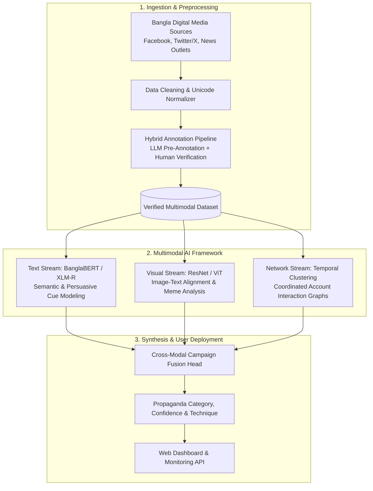
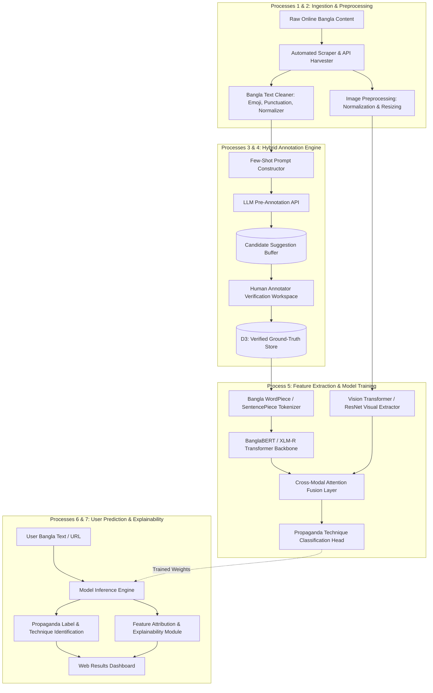

# Focused Gap Analysis & Content Blueprint for Bangla Propaganda Report

**Project Title:** A Multimodal AI Framework for Detecting Coordinated Propaganda in Bangla Online Media Content  
**Target Program:** B.Sc. in Computer Science and Engineering, United International University (UIU)  
**Authors:** Shekh Abdullah Al Mehedi (112231075), Mahjabin Khan (112230177), Omor Faruck Ullas (112310384), Md. Rayan Rahman (112331071)  
**Supervisor:** Dr. Jannatun Noor Mukta  
**Group:** 262-037  

---

## Scope Adjustment

Per your specification, the following sections are **excluded** from this gap blueprint:
- ❌ *Front Matter:* Abstract, Acknowledgements, Publication List, Lists of Figures & Tables
- ❌ *Chapter 4:* Implementation and Results
- ❌ *Chapter 6:* Conclusion, Limitations & Future Work

Below is the **exact, high-priority technical content** from the template that you **must add or modify** in your report to complete the technical design and satisfy the **UIU / BAETE (Washington Accord)** capstone requirements:

1. **Chapter 1:** Section 1.4 High-Level Workflow Diagram (Figure 1.1)
2. **Chapter 2:** Section 2.2.3 Literature Review Summary Table (Table 2.1)
3. **Chapter 3:** 
   - Section 3.2.3 Detailed Level-2 Data Flow Diagram (DFD Level 2)
   - Section 3.3 Design Rationale & Trade-off Evaluation Matrix (Table 3.1)
   - Section 3.4 Project Plan & Gantt Chart (Figure 3.5)
   - Section 3.5 Team Task Allocation
4. **Chapter 5 (Full Chapter):** 
   - 5.1 Standards Compliance (Software, Hardware, Communication)
   - 5.2 Real-World Design Constraints (Economic, Environmental, Ethical, Safety, Social, Political, Sustainability)
   - 5.3 Cost Analysis & Budgets (Proposed Budget Table 5.1, Alternate Budget Table 5.2, Revenue Model)
   - 5.4 Complex Engineering Problem (P1–P7 Mapping Table 5.3) & Engineering Activities (A1–A5 Mapping Table 5.4)

---

# 1. Chapter 1 Addition: Overall System Workflow Diagram

### What to Add:
In your report's **Section 1.4 (Methodology)**, add a dedicated visual architecture diagram (**Figure 1.1**) before the methodology bullet points. Evaluators need to see the entire pipeline at a glance.


*Figure 1.1: Overall Workflow of the Proposed Bangla Propaganda Detection Framework*

---

# 2. Chapter 2 Addition: Literature Review Summary Table

### What to Add:
In your report's **Section 2.2.3**, add **Table 2.1: Summary of Related Research Papers**. The template dedicates significant space to this table because FYDP defense committees require a tabular synthesis of past work, datasets, findings, and shortcomings.

### Insert as Section 2.2.3:
```markdown
### 2.2.3 Summary of Literature
Table 2.1 provides a systematic comparative summary of the reviewed literature, outlining the core computational methods, benchmark datasets, key findings, and critical limitations of prior work.

#### Table 2.1: Summary of Related Research Papers
| Paper Title & Citation | Year | Dataset Used | Key Methodology & Findings | Critical Limitations |
| :--- | :--- | :--- | :--- | :--- |
| **The spread of propaganda by coordinated communities on social media** [1] | 2022 | Twitter (Italian elections & COVID-19) | Analyzed coordinated link-sharing networks and bot behavior using network graphs. Found that propaganda spreaders exhibit significantly higher coordination than benign users. | Evaluated only on high-resource languages (Italian/English); text semantics were secondary to network topology; lacks multimodal analysis. |
| **BanFakeNews: A dataset for detecting fake news in Bangla** [2] | 2020 | BanFakeNews (50,000 Bangla news articles) | Landmark benchmark Bangla dataset for fake news detection; evaluated SVM, Random Forest, and LSTM architectures. | Focuses strictly on factual veracity (fake vs. real) rather than rhetorical propaganda techniques; purely text-based without social context or coordination tracking. |
| **BanMANI: A dataset to identify manipulated social media news in Bangla** [3] | 2023 | BanMANI (Social media news posts) | Categorizes social media news manipulation into multiple classes; demonstrates the efficacy of transfer learning. | Small dataset size; does not analyze coordinated amplification campaigns or image-text multimodal relationships. |
| **Coordinated information campaigns on social media** [4] | 2023 | Twitter / Reddit multi-domain data | Multi-faceted framework fusing semantic similarity, temporal proximity, and network clustering to detect coordinated operations. | Computationally intensive; designed primarily for English; relies on extensive historical user activity graphs often unavailable in low-resource contexts. |
| **Detection of propaganda and bias in social media: Israel–Gaza war** [5] | 2025 | Arabic X (Twitter) posts | Evaluated classical ML (SVM) against deep learning (AraBERT); SVM achieved superior performance on propaganda classification while AraBERT excelled at bias detection. | Restricted to short text posts; does not address multimodal memes or cross-platform campaign coordination. |
| **Hierarchical graph-based integration network for propaganda detection** [9] | 2025 | SemEval propaganda corpus (English) | H-GIN model capturing long-range, non-adjacent token relationships via graph neural networks; reported 82% accuracy. | Operates solely on English long-form news articles; high graph construction latency; no support for low-resource or code-mixed text. |
| **Text-image multimodal fusion model for fake news detection** [10] | 2024 | Weibo & Twitter multimodal benchmarks | Cross-modal attention network fusing visual features (ResNet/ViT) with textual embeddings (BERT); showed multimodal fusion outperforms unimodal baselines. | Evaluated on Chinese and English benchmarks; vulnerable to false positives when meme text and images are intentionally incongruent. |
| **On explaining multimodal hateful meme detection models** [11] | 2022 | Facebook Hateful Memes dataset | Investigates multimodal interpretability; reveals that multimodal models frequently latch onto background image biases and surface textual heuristics. | Demonstrates explainability challenges; lacks application to political propaganda in South Asian contexts. |
| **Beyond content: Behavioral policies reveal actors in information operations** [12, 14] | 2024–2026 | Twitter & Reddit coordinated influence sets | Models user behavioral policies (posting timing, activity patterns) reaching 94.9% macro-F1, outperforming text embeddings (91.2%). | Requires rich temporal account metadata; unviable for anonymous or newly created ephemeral accounts. |
| **BD-SHS: Benchmark dataset for learning online Bangla hate speech** [15] | 2022 | BD-SHS (Bangla social comments) | Diverse benchmark across multiple social categories; achieved 91.0% F1-score using transformer fine-tuning. | Focuses on abusive language rather than persuasive propaganda techniques; lacks coordination and image features. |
| **LLM-based multi-task Bangla hate speech detection** [8] | 2026 | BanglaMultiHate dataset | Multi-task framework evaluating classical ML, BanglaBERT, and few-shot LLMs across hate speech type, severity, and target. | Demonstrates that while LLMs show promise, domain-specialized models (BanglaBERT) often yield superior and more consistent F1 on local cultural nuances. |
| **HQP: A human-annotated dataset for detecting online propaganda** [22] | 2024 | HQP (English articles) | Proves data quality impact: models trained on weak labels got 64.03 AUC, whereas human-annotated data achieved 92.25 AUC. Prompt-learning with small verified sets achieved 80.27 AUC. | English-only; underscores the vital necessity of human verification over pure LLM automated annotation. |
```

---

# 3. Chapter 3 Additions: System Engineering Details

Your Chapter 3 has the Level-1 DFD and UI wireframe, but is missing **four key engineering components** that are fully realized in the template report.

---

### 3.1 Addition: Detailed Level-2 Data Flow Diagram (DFD Level 2)
Add this diagram in **Section 3.2.3** immediately following the Level-1 DFD to explain internal processing:


*Figure 3.3: Detailed Level-2 Data Flow Diagram (DFD) for the Proposed System*

---

### 3.2 Addition: Design Rationale & Trade-off Evaluation Matrix
In **Section 3.3**, summarize your alternative solutions text into **Table 3.1**:

#### Table 3.1: Design Rationale and Trade-off Evaluation Matrix
| Design Layer | Considered Alternative | Selected Choice & Engineering Rationale |
| :--- | :--- | :--- |
| **Dataset Creation Strategy** | Fully manual annotation from scratch (10,000+ samples). | **Hybrid LLM Pre-Annotation + Human Verification:** Reduces manual annotator fatigue and labeling costs by ~60% while strictly preserving ground-truth fidelity through expert human sign-off [22]. |
| **Annotation Authority** | Fully autonomous LLM zero-shot labeling. | **Human-in-the-Loop Ground Truth:** Pure LLM labels suffer from hallucination and cultural blindness in Bangla idioms; human verification ensures zero label corruption [8, 22]. |
| **Core NLP Backbone** | Classical Machine Learning (TF-IDF + SVM / Naive Bayes). | **Fine-tuned Pretrained Transformers (BanglaBERT & XLM-R):** Captures bidirectional contextual semantics, sarcasm, and rhetorical nuances that n-gram models miss. Classical ML is retained strictly as an E1 baseline. |
| **Monolingual vs. Multilingual** | Using generic multilingual models only (mBERT / XLM-R). | **Dual Evaluation (BanglaBERT vs. XLM-R):** BanglaBERT provides deep vocabulary specialization for Bengali script, while XLM-R tests cross-lingual robustness against code-mixed Bangla-English text. |
| **Modality Scope** | Full Multimodal (Video + Audio + Text + Network) from Day 1. | **Phased Extensible Modular Architecture:** Phase 1 establishes robust text detection and dataset verification; Phase 2 incorporates image-text meme fusion; Phase 3 integrates graph coordination metrics. |
| **Class Imbalance Strategy** | Standard Cross-Entropy training on raw class distribution. | **Cost-Sensitive Loss Weighting + Strategic Oversampling:** Prevents model bias toward the dominant "No Propaganda" class and guarantees viable recall on minority propaganda techniques (e.g., Bandwagon, Fear Appeal). |

---

### 3.3 Addition: Project Plan & Gantt Chart
Insert **Section 3.4 (Project Plan)** with a 25-week execution Gantt chart:

```markdown
## 3.4 Project Plan
The project lifecycle is planned across three consecutive academic trimesters (25 weeks), structured into four distinct engineering phases:

```mermaid
gantt
    title Bangla Propaganda Detection Project Timeline (Weeks 1–25)
    dateFormat  X
    axisFormat Week %s

    section Phase 1: Planning
    Literature Review & Taxonomy Definition :done, p1, 1, 8
    Requirements & Architectural Specification:done, p2, 3, 8

    section Phase 2: Data Pipeline
    Web Scraping & Social Media Data Ingestion:active, p3, 5, 14
    LLM Pre-Annotation Prompt Engineering   :active, p4, 7, 12
    Human Expert Annotation & Verification  :active, p5, 9, 16

    section Phase 3: Modeling & Evaluation
    Classical Baseline Development (SVM/NB) :crit, p6, 15, 18
    BanglaBERT & XLM-R Fine-Tuning          :crit, p7, 16, 21
    Class Imbalance Mitigation & Testing    :crit, p8, 18, 22

    section Phase 4: UI & Deployment
    Explainability Module & UI Dashboard    :p9, 20, 24
    System Benchmarking & Final Thesis Draft:p10, 22, 25
```


*Figure 3.5: Gantt Chart of Project Execution Lifecycle*

- **Phase 1: Requirements Gathering & Taxonomy Definition (Weeks 1–8):** Systematic review of propaganda literature, defining the Bangla propaganda technique taxonomy, and architecting the DFD.
- **Phase 2: Data Curation & Hybrid Annotation (Weeks 5–16):** Gathering raw posts, prompt engineering for LLM pre-annotation, and conducting human expert verification to construct the verified dataset.
- **Phase 3: Model Training & Experimental Benchmarking (Weeks 15–22):** Fine-tuning BanglaBERT and XLM-R, implementing cost-sensitive loss weighting, and conducting ablation experiments E1–E6.
- **Phase 4: Dashboard Integration & Final Thesis (Weeks 20–25):** Integrating the prediction engine with the web user interface, generating explainability summaries, and writing the final thesis report.
```

---

### 3.4 Addition: Task Allocation Section
Insert **Section 3.5 (Task Allocation)** explicitly assigning responsibilities to your 4 group members:

```markdown
## 3.5 Task Allocation
Project responsibilities are divided among team members according to technical sub-disciplines:

- **Shekh Abdullah Al Mehedi (ID: 112231075):** Data pipeline architecture, automated web scraping infrastructure, data cleaning/normalization, and database management.
- **Mahjabin Khan (ID: 112230177):** Annotation pipeline design, LLM prompt engineering for pre-annotation, annotator guideline drafting, and human verification coordination.
- **Omor Faruck Ullas (ID: 112310384):** Machine learning pipeline, Transformer model fine-tuning (BanglaBERT & XLM-R), class imbalance mitigation, and loss function engineering.
- **Md. Rayan Rahman (ID: 112331071):** System evaluation, benchmarking experiments (E1–E6), confusion matrix error analysis, and web UI/API development.
```

---

# 4. Chapter 5 Addition: Standards, Constraints & Complex Engineering (Full Chapter)

### Why this is Essential:
Your report currently stops after Chapter 3. For UIU CSE accreditation under **BAETE / Washington Accord**, **Chapter 5 is mandatory**. If your report lacks the Complex Problem Solving (P1–P7) and Complex Engineering Activities (A1–A5) tables, it will fail accreditation checks.

### Complete Content to Add as Chapter 5:

```markdown
# Chapter 5: Standards and Design Constraints

This chapter details the engineering standards, real-world design constraints, financial budget analysis, and formal mapping to Washington Accord / BAETE Complex Engineering Problem Solving criteria guiding the development of the Bangla Propaganda Detection framework.

## 5.1 Compliance with Standards
To ensure reproducibility, maintainability, and interoperability, the project adheres to established technical standards:
- **5.1.1 Software Standards:** 
  - Adherence to **PEP 8** style guidelines for all Python modules.
  - Utilization of standardized machine learning frameworks (**PyTorch**, **Hugging Face Transformers**) to ensure cross-platform reproducibility.
  - Implementation of **RESTful API** conventions using FastAPI/Flask and **JSON Schema** for structured data exchange.
- **5.1.2 Hardware & Cloud Standards:** 
  - Compliance with standard GPU computing interfaces (CUDA 12.x, OpenCL) to allow portable training across both local workstations and cloud infrastructure.
- **5.1.3 Communication & Security Standards:** 
  - Enforcing **HTTPS (TLS 1.3)** encryption for all web interface interactions and API queries.
  - Adoption of the **Schema.org ClaimReview** structured data standard to ensure interoperability with international fact-checking platforms.

## 5.2 Realistic Design Constraints

### 5.2.1 Economic Constraint
Academic and independent journalistic organizations in Bangladesh operate under strict financial limits. The framework avoids dependence on proprietary per-token cloud APIs (e.g., proprietary LLM inference) for runtime detection. Instead, the final model is distilled and fine-tuned into open-weight transformer backbones (BanglaBERT) capable of low-cost local or edge deployment.

### 5.2.2 Environmental Constraint
Training large generative architectures from scratch consumes enormous electrical power. We constrain our carbon footprint by utilizing transfer learning—fine-tuning existing open-source pretrained representations rather than training models from scratch.

### 5.2.3 Ethical Constraint
Detecting political propaganda carries significant ethical risks regarding censorship, freedom of speech, and algorithmic political bias. To uphold ethical standards:
- The system outputs probability confidence scores and explainable rationale rather than absolute binary judgments.
- Training data is balanced across diverse political viewpoints to prevent partisan favoritism.
- Public data collection strictly complies with platform Terms of Service, and personal identifiers are anonymized.

### 5.2.4 Health and Safety Constraint
While software does not cause direct physical harm, coordinated disinformation in Bangladesh has repeatedly triggered real-world communal violence and riots. Erroneous detection could amplify panic or silence legitimate reporting. The system incorporates human-in-the-loop review safeguards before high-consequence moderation flags are triggered.

### 5.2.5 Social Constraint
The tool is designed to empower citizens, journalists, and researchers to think independently rather than having their views manipulated by coordinated actors. The user interface is crafted in clear, accessible Bangla to serve users across varying levels of technical literacy.

### 5.2.6 Political Constraint
The project operates strictly within the legal bounds of Bangladesh’s Cyber Security Act and digital data protection policies, maintaining neutrality and strictly avoiding algorithmic political profiling.

### 5.2.7 Sustainability
The framework relies exclusively on open-source libraries and open-weight models, ensuring that the software can be maintained, adapted, and extended by the research community without ongoing commercial licensing fees.

---

## 5.3 Cost Analysis

### 5.3.1 Proposed Budget
The proposed budget accounts for dedicated computational resources, data storage, and verification honorariums:

#### Table 5.1: Proposed Budget for Bangla Propaganda Detection Project
| Category | Description | Estimated Cost (BDT) |
| :--- | :--- | :---: |
| **Computational Resources** | Dedicated GPU workstation time, RAM, and cloud compute subscriptions for Transformer training | 1,80,000 |
| **Data Collection & Storage** | Cloud database storage for multimodal social media corpus and automated scraper hosting | 45,000 |
| **Annotation & Expert Verification**| Honorarium for domain experts and linguists conducting ground-truth label verification | 60,000 |
| **Miscellaneous & Contingency** | High-speed broadband data packages and unexpected contingency expenses | 5,000 |
| **Total** | | **2,90,000 BDT** |

### 5.3.2 Alternate Budget and Rationale
To accommodate severe financial constraints, an alternate low-cost budget leveraging free academic resources is established:

#### Table 5.2: Alternate Low-Cost Budget
| Category | Description | Estimated Cost (BDT) |
| :--- | :--- | :---: |
| **Computational Resources** | Free-tier Google Colab (T4 GPUs) & UIU Department Computer Lab workstations | 0 |
| **Data Collection & Storage** | Local workstation hard drive storage & university Google Drive allocation | 0 |
| **Annotation & Verification** | Internal student team manual verification under faculty supervision | 0 |
| **Miscellaneous** | Contingency buffer | 2,500 |
| **Total** | | **2,500 BDT** |

**Rationale:** While the alternate budget incurs near-zero financial cost, the Proposed Budget (Table 5.1) is strongly preferred. Training deep transformer networks on free Colab instances suffers from frequent kernel disconnects, timeouts, and limited GPU memory. Dedicated resources guarantee reliable experimental reproducibility.

### 5.3.3 Sustainability & Post-FYDP Revenue Model
To sustain the platform after project completion:
1. **Open-Source Core:** The trained model weights and benchmark dataset are freely released to the academic community.
2. **B2B / API Licensing for Newsrooms:** Offering an automated verification API to independent digital newsrooms and fact-checking organizations in Bangladesh under a software-as-a-service (SaaS) subscription model.
3. **Grant Funding:** Seeking research grants from organizations focused on digital literacy, counter-disinformation, and low-resource NLP.

---

## 5.4 Complex Engineering Problem (BAETE / Washington Accord)

### 5.4.1 Complex Problem Solving Mapping
Project evaluation criteria mapped against Washington Accord Complex Engineering Problem criteria (P1–P7):

#### Table 5.3: Mapping with Complex Problem Solving Criteria (P1–P7)
| Attribute | P1: Depth of Knowledge | P2: Conflicting Requirements | P3: Depth of Analysis | P4: Familiarity of Issues | P5: Applicable Codes | P6: Stakeholder Involvement | P7: Inter-dependence |
| :---: | :---: | :---: | :---: | :---: | :---: | :---: | :---: |
| **Status** | $\checkmark$ | $\checkmark$ | $\checkmark$ | $\checkmark$ | $\checkmark$ | $\checkmark$ | $\checkmark$ |

- **P1: Depth of Knowledge Required:** Synthesizes Natural Language Processing (Transformers, attention mechanisms), Multimodal Computer Vision (ViT, ResNet), Graph Theory (coordinated social networks), and Linguistic Rhetoric. Aligns with **WK3** (Advanced engineering knowledge) and **WK4** (Specialist AI/ML architecture knowledge).
- **P2: Range of Conflicting Requirements:** Balancing deep contextual accuracy with computational inference latency; balancing aggressive propaganda detection with the protection of free speech and political satire.
- **P3: Depth of Analysis Required:** In-depth modeling of subtle rhetorical propaganda techniques (loaded language, fear appeals, bandwagon) in morphologically rich, code-mixed Bangla text.
- **P4: Familiarity of Issues:** Detecting coordinated propaganda campaigns in under-resourced Bangla digital media is largely uncharted territory compared to standard English fake-news benchmarks.
- **P5: Extent of Applicable Codes:** Strict adherence to data privacy, digital copyright, platform terms of service, and ethical AI fairness standards.
- **P6: Extent of Stakeholder Involvement:** Involves diverse stakeholders including digital media consumers, journalists, academic researchers, and content moderators.
- **P7: Inter-dependence:** High inter-dependence across web scraping, preprocessing, hybrid annotation, transformer fine-tuning, and user result generation; an error or bias in annotation ripples through the entire classification pipeline.

### 5.4.2 Complex Engineering Activities Mapping
#### Table 5.4: Mapping with Complex Engineering Activities (A1–A5)
| Attribute | A1: Range of Resources | A2: Level of Interaction | A3: Innovation | A4: Consequences for Society | A5: Familiarity |
| :---: | :---: | :---: | :---: | :---: | :---: |
| **Status** | $\checkmark$ | $\checkmark$ | $\checkmark$ | $\checkmark$ | $\checkmark$ |

- **A1: Range of Resources:** GPU clusters, cloud storage, large-scale web scrapers, transformer toolkits, and human expert linguistic annotators.
- **A2: Level of Interaction:** Continuous synergy between computational NLP subsystems and human domain experts during the two-tier verification workflow.
- **A3: Innovation:** Novel hybrid LLM-human annotation paradigm and multi-faceted coordinated campaign detection framework tailored specifically to Bangla online media.
- **A4: Consequences for Society and Environment:** Substantial societal impact in safeguarding civic discourse and countering dangerous communal manipulation in Bangladesh.
- **A5: Familiarity:** Requires innovative adaptation of cross-lingual transfer learning to overcome the severe data scarcity characteristic of low-resource Bangla NLP.

## 5.5 Summary
This chapter formalized the engineering standards, realistic constraints, economic feasibility budgets, and rigorous BAETE accreditation mappings that validate this research as a comprehensive complex engineering capstone project.
```
